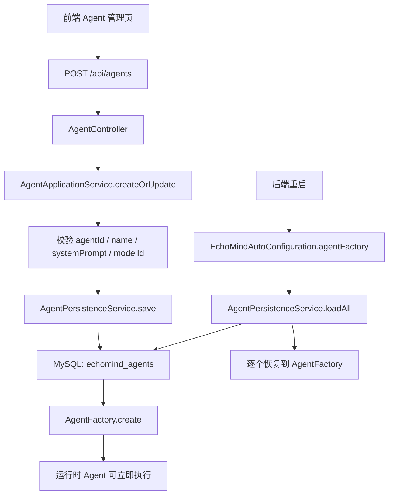
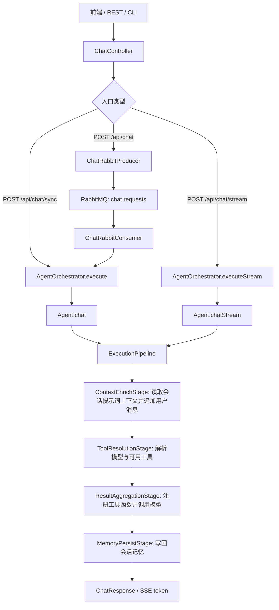
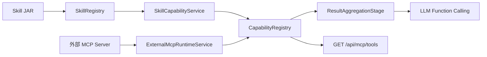
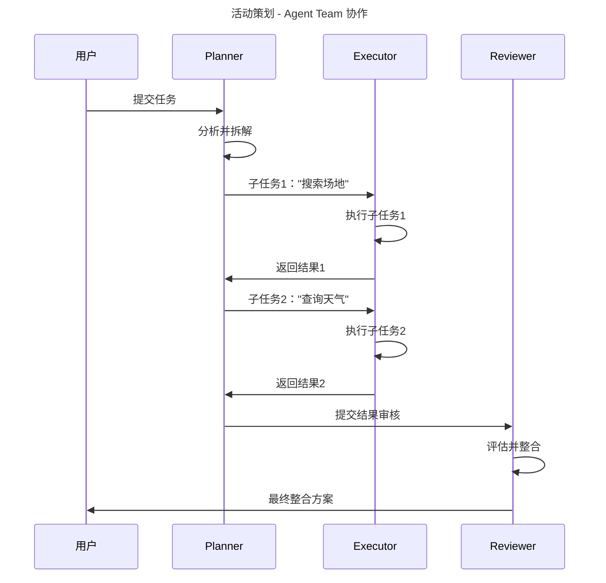

# EchoMind — AI Agent 平台

EchoMind 是一个模块化的 AI Agent 平台，基于 Spring Boot 3.3 / Java 17，支持 MCP 协议、插件式 Skill 市场和前端暗黑主题控制台。

## 技术架构

```
用户 / CLI / REST API
         |
   echomind-console (Controller + ApplicationService + CLI)
         |
   echomind-agent (编排器 + Pipeline + Capability)
    /    |    \        \
   /     |     \        \
LLM    Memory   MCP    Skill 市场
                |
          skill-filesystem (文件读写)
```

### 架构边界

EchoMind 现在按“管理面 MVC + 智能执行 Pipeline + 工具能力注册表”的方式组织：

| 层 | 代表类 | 责任 |
|---|---|---|
| HTTP / CLI 边界 | `AgentController`、`ChatController`、`EchoMindShell` | 接收请求、解析参数、返回 DTO，不直接拼业务流程 |
| 应用服务层 | `AgentApplicationService`、`ChatApplicationService` | 编排用例，负责校验、事务顺序、运行时同步 |
| 运行时层 | `AgentOrchestrator`、`ExecutionPipeline`、`CapabilityRegistry` | 执行 Agent、模型路由、工具注册和调用 |
| 持久化层 | `AgentRepository`、`SkillEntityRepository`、`ChatMessageRepository`、`MemoryEmbeddingRepository` | 保存配置、会话消息和可重建的向量备份 |

需要长期保留的数据必须进入持久化层。`AgentFactory`、`SkillRegistry`、`CapabilityRegistry`
只做运行时索引，不能作为事实来源；重启后会从 MySQL 或 Skill 目录重新恢复。

### 数据事实来源

| 数据 | 事实来源 | 运行时缓存/索引 |
|---|---|---|
| Agent 配置 | MySQL `echomind_agents` | `AgentFactory` |
| Skill 元数据和启停状态 | MySQL `echomind_skills` + Skill JAR | `SkillRegistry`、`CapabilityRegistry` |
| 当前对话记忆 | MySQL `echomind_chat_sessions` / `echomind_chat_messages` | Redis `echomind:memory:recent:*` 近期上下文缓存 + Redis Stack 向量索引 |
| 工具可用性 | 已启用 Skill + 已挂载外部 MCP 服务 | `CapabilityRegistry` |

### Agent 创建与恢复链路



创建 Agent 时会先写 MySQL，再刷新运行时 `AgentFactory`。如果同一个 `agentId` 再次提交，
会覆盖数据库中的配置并刷新运行时 Agent。后端重启时，自动配置会先读取
`echomind_agents`，再补齐配置文件中声明但数据库没有的默认 Agent。

## 调用链路

### 聊天主链路



同步请求走 `POST /api/chat/sync`，`ChatController` 创建或复用前端 `sessionId` 后，调用
`AgentOrchestrator.execute(agentId, sessionId, message)`。编排器根据 `agentId` 找到 Agent，
组装 `PipelineContext`，再交给 `Agent.chat()` 执行完整管线。

异步请求走 `POST /api/chat`，控制器只生成 `requestId` 并把 `ChatRequest` 投递到 RabbitMQ。
`ChatRabbitConsumer` 消费后执行同一条 Agent 管线，最终结果进入 `chat.responses`，
`SsePushService` 再通过 `GET /api/chat/stream/{requestId}` 推送给前端。

直接流式请求走 `POST /api/chat/stream`，不经过 RabbitMQ。控制器调用
`AgentOrchestrator.executeStream()`，管线先执行到工具阶段，再由 `ResultAggregationStage`
订阅模型提供商的流式输出，并把每个 token 作为 SSE 事件返回；流结束后再由记忆阶段持久化。

### 管线阶段

| 顺序 | 阶段 | 责任 |
|---|---|---|
| 10 | `ContextEnrichStage` | 使用 `ctx.getMemoryKey()` 读取会话提示词上下文，把用户本轮消息加入上下文 |
| 20 | `ToolResolutionStage` | 根据 Agent 默认模型或请求参数选择模型，并整理可用工具 |
| 40 | `ResultAggregationStage` | 调用 `ModelProviderRegistry` 选中的 DeepSeek / OpenAI 兼容 / Mock Provider，并把可用 Tool 注册为模型函数 |
| 50 | `MemoryPersistStage` | 把用户消息与最终助手回复写回记忆管理器 |

当前记忆按一次对话隔离：`PipelineContext.getMemoryKey()` 优先返回 `sessionId`，
所以每条对话历史拥有自己的记忆槽。`agentId` 只表示本轮由哪个 Agent 执行，
不会再让多个会话共享同一份 Agent 记忆。

### Skill、外部 MCP 与工具能力链路

Skill 由 `SkillDirectoryWatcher` 加载到 `SkillRegistry`，随后 `SkillCapabilityService`
会把已启用 Skill 同步到 `CapabilityRegistry`，供 Agent 对话时调用。

外部 MCP Server 由 `ExternalMcpRuntimeService` 管理：启动时会挂载配置文件里的
`echomind.mcp.external-servers`，运行时也可以通过前端 MCP 管理页或 REST 接口动态挂载、
刷新和卸载。挂载成功后，它的工具会进入同一个 `CapabilityRegistry`，模型函数调用可以
像使用本地 Skill 一样使用这些外部工具。



工具调用采用“动态关键词优先，模型兜底”的策略：`ResultAggregationStage` 会先让
`ToolRouter` 在当前 Agent 允许的工具范围内按工具元数据打分匹配。强信号来自 Skill JAR
自带的 `keywords`、`aliases`、`tags` 和工具名；描述和参数 Schema 只作为弱信号，避免误收窄。
如果达到强匹配阈值，就只把命中的工具转换为模型函数定义，模型再根据工具描述和参数 Schema
自主决定是否调用；如果没有强命中，才把当前 Agent 允许的全部工具交给模型智能判断。
禁用 Skill 后，它会从能力注册表移除，旧对话也不能继续调用已禁用工具。

新 Skill JAR 推荐在 `SkillMetadata` 中填写 `keywords` 和 `aliases`，例如
`keywords=["发票审核","报销","invoice audit"]`、`aliases={"invoice":["发票","票据"]}`。
这样新领域工具可以自己带触发词，不需要修改平台代码。

MCP 的 REST 管理入口在 `/api/mcp` 下：`GET /api/mcp/servers` 查看已挂载服务，
`POST /api/mcp/servers` 动态挂载 stdio MCP Server，`DELETE /api/mcp/servers/{id}` 卸载服务，
`POST /api/mcp/servers/{id}/refresh` 重新读取工具列表。`GET /api/mcp/tools` 只列出外部 MCP 工具，
`POST /api/mcp/tools/{name}/call` 可直接调用这些外部工具。

### Agent Team 链路

团队任务从 `TeamController` 创建异步 Run，`TeamBlackboardService` 将 Team、Run、Step、Event 写入
MySQL 黑板，再由 `TaskExecutor` 后台推进状态机。Planner 结构化拆解 Step，Reviewer 先审查计划，
Executor 按能力标签并发执行，Reviewer 再对照初始需求审查结果、触发重试或澄清，并生成最终报告。
每个角色最终仍通过 `AgentOrchestrator -> Agent -> ExecutionPipeline` 执行，但角色之间通过黑板交换上下文。

## 模块说明

| 模块 | 说明 |
|---|---|
| `echomind-common` | 共享模型（AgentMessage）、异常体系、JSON Schema 校验 |
| `echomind-skill-api` | Skill 接口规范 —— 零依赖纯 SPI |
| `echomind-llm` | 动态模型路由，支持 DeepSeek / OpenAI 兼容 / 阿里云百炼，Anthropic 可选接入 |
| `echomind-memory` | MySQL 完整会话历史 + Redis 近期上下文缓存 + Redis Stack/百炼向量检索，记忆按 sessionId 隔离 |
| `echomind-mcp` | 外部 MCP 客户端、stdio 传输客户端、工具适配器 |
| `echomind-skill` | Skill 注册中心、ClassLoader 隔离、市场管理 |
| `echomind-agent` | Agent 执行管线、编排调度、Agent MySQL 持久化、统一能力注册 |
| `echomind-agent-team` | 多 Agent 协作（Planner / Executor / Reviewer） |
| `echomind-console` | REST API + 应用服务层 + Vue 3 前端 + Spring Shell CLI |
| `echomind-boot` | Spring Boot 自动配置 |
| `echomind-app` | 应用启动入口 |
| `skill-weather` | 天气查询 Skill（wttr.in） |
| `skill-calculator` | 数学表达式计算 Skill（exp4j） |
| `skill-websearch` | 网页搜索 Skill（DuckDuckGo） |
| `skill-filesystem` | 文件读写 Skill |

## 快速开始

### 环境要求
- Java 17+
- Maven 3.8+
- 环境变量：`DEEPSEEK_API_KEY`、`DEEPSEEK_BASE_URL`

### 方式一：Docker Compose（推荐）

```bash
cd EchoMind
docker compose up -d
```

一键启动 MySQL + Redis + 后端 + 前端，访问 `http://localhost`。

服务清单：

| 服务 | 端口 | 说明 |
|------|------|------|
| mysql | 3306 | MySQL 8.3，数据持久化 |
| redis | 6379 | Redis Stack，近期上下文缓存 + 向量检索 |
| backend | 8080 | Spring Boot 后端 |
| frontend | 80 | Vue 3 前端（Nginx） |

如果 Docker 构建环境访问 Maven Central 不稳定，可以先用本机 Maven 打生产包，再使用运行镜像
Dockerfile 部署后端：

```bash
mvn clean package -Dmaven.test.skip=true
docker build -f Dockerfile.runtime -t ai-agent-backend:latest .
docker compose up -d backend frontend
```

`Dockerfile.runtime` 只复制 `echomind-app/target` 和 `skills/*/target` 中的产物，不在容器内下载
Maven 依赖；常规 CI 或网络稳定环境仍可继续使用默认 `Dockerfile` 的多阶段构建。

### 方式二：本地运行

```bash
# 构建
mvn clean package -DskipTests

# 启动后端
mvn -f echomind-app/pom.xml spring-boot:run

# 启动前端（新终端）
cd echomind-web
npm install
npm run dev
```

- 前端控制台：`http://localhost:5173`
- 后端 API：`http://localhost:8080`
- H2 控制台（开发环境）：`http://localhost:8080/h2-console`

## API 参考

| 方法 | 端点 | 说明 |
|---|---|---|
| `POST` | `/api/chat` | 异步发送消息，返回 requestId 和 sessionId |
| `GET` | `/api/chat/stream/{requestId}` | 订阅异步最终结果 SSE |
| `POST` | `/api/chat/sync` | 同步执行 Agent 并返回完整回复 |
| `POST` | `/api/chat/stream` | 直接流式执行，逐 token 返回 SSE |
| `GET` | `/api/chat/sessions` | 列出有记忆的会话摘要 |
| `GET` | `/api/chat/{sessionId}/history` | 查询会话历史 |
| `GET` | `/api/models` | 列出可用模型 |
| `PUT` | `/api/models/switch` | 切换默认模型 |
| `GET` | `/api/skills` | 列出所有 Skill |
| `POST` | `/api/skills/upload` | 上传 Skill JAR 包 |
| `POST` | `/api/skills/{id}/enable` | 启用 Skill |
| `POST` | `/api/skills/{id}/disable` | 禁用 Skill |
| `DELETE` | `/api/skills/{id}` | 删除 Skill |
| `GET` | `/api/agents` | 列出所有 Agent |
| `POST` | `/api/agents` | 创建或覆盖 Agent，并写入 MySQL |
| `POST` | `/api/agents/{id}/execute` | 执行 Agent |
| `GET` | `/api/mcp/servers` | 列出已挂载外部 MCP 服务 |
| `POST` | `/api/mcp/servers` | 动态挂载外部 stdio MCP 服务 |
| `POST` | `/api/mcp/servers/{id}/refresh` | 刷新外部 MCP 服务工具列表 |
| `DELETE` | `/api/mcp/servers/{id}` | 卸载外部 MCP 服务 |
| `GET` | `/api/mcp/tools` | 列出外部 MCP 工具 |
| `POST` | `/api/mcp/tools/{name}/call` | 调用外部 MCP 工具 |
| `GET` | `/api/memory/{sessionId}` | 查询会话记忆 |
| `DELETE` | `/api/memory/{sessionId}` | 清除会话记忆 |
| `GET` | `/api/teams` | 列出 Agent 团队 |
| `POST` | `/api/teams` | 创建团队，Reviewer 必填 |
| `DELETE` | `/api/teams/{id}` | 硬删除团队及其 Run/Step/Event 黑板记录 |
| `POST` | `/api/teams/{id}/runs` | 创建异步团队 Run |
| `GET` | `/api/teams/{id}/runs/{runId}` | 查询 Run 黑板、Step 和事件 |
| `POST` | `/api/teams/{id}/runs/{runId}/resume` | 提交澄清信息并继续 Run |
| `POST` | `/api/teams/{id}/execute` | 兼容旧同步执行入口 |

## CLI 命令

```
echomind> chat --agent default "帮我查一下东京的天气"
echomind> models
echomind> model-switch --provider deepseek --model deepseek-v4-flash
echomind> skill-list
echomind> agents
```

## Skill 开发指南

### 1. 在 `skills/` 下创建 Maven 模块

```xml
<dependency>
    <groupId>com.echomind</groupId>
    <artifactId>echomind-skill-api</artifactId>
    <scope>provided</scope>
</dependency>
```

### 2. 实现 Skill 接口

```java
public class MySkill implements Skill {
    @Override
    public SkillMetadata metadata() {
        return new SkillMetadata("my-skill", "1.0.0", "技能描述",
            Map.of(...), List.of(), "作者", List.of("标签"));
    }

    @Override
    public CompletableFuture<SkillResult> execute(SkillRequest request) {
        return CompletableFuture.supplyAsync(() -> {
            // 你的技能逻辑
            return SkillResult.success("输出结果", elapsedMs);
        });
    }
}
```

### 3. 配置 JAR Manifest

```xml
<plugin>
    <groupId>org.apache.maven.plugins</groupId>
    <artifactId>maven-jar-plugin</artifactId>
    <configuration>
        <archive>
            <manifestEntries>
                <EchoMind-Skill-Class>com.echomind.skill.example.MySkill</EchoMind-Skill-Class>
                <EchoMind-Skill-Version>1.0.0</EchoMind-Skill-Version>
            </manifestEntries>
        </archive>
    </configuration>
</plugin>
```

### 4. 构建并部署

```bash
mvn package -pl skills/skill-example
cp skills/skill-example/target/skill-example-1.0.0-SNAPSHOT.jar ./skills/
```

Skill 目录监听器会自动检测并热加载新的 Skill。

## Agent Team 协作

EchoMind 支持多 Agent 角色协作。Team 定义、Run、Step 和 Event 都落 MySQL，作为团队共享黑板：

```
用户任务 → Planner（结构化拆解 Step）
              ↓
        Reviewer（规划后审查）
              ↓
        多 Executor（按能力标签并发执行）
              ↓
        Reviewer（结果审查 / 重试 / 澄清 / 最终报告）
              ↓
        Run 看板 + Mermaid 流程图
```

### 演示场景：活动策划

```
输入："为60人策划一场公司户外团建活动"

Planner 拆解：
  1. 搜索场地选项
  2. 查询天气预报
  3. 估算预算
  4. 制定时间表

Executor 按能力标签分配并调用相关 Skill 处理每个子任务：
  - web-search → 场地选项
  - weather-query → 天气预报
  - calculator → 预算计算

Reviewer 先审查 Planner 拆解是否覆盖初始需求，再对比所有 Executor 原始结果。
如果结果不合格，Reviewer 返回 `RETRY` 并点名重跑指定 Step；如果需求有歧义，返回
`ASK_CLARIFICATION` 暂停 Run；通过后输出完整策划方案。
```

### 协作流程图



## 配置说明

默认 `application.yml`：

```yaml
echomind:
  models:
    default-provider: deepseek
    providers:
      deepseek:
        api-key: ${DEEPSEEK_API_KEY}
        base-url: ${DEEPSEEK_BASE_URL:https://api.deepseek.com/anthropic}
        models:
          - name: deepseek-v4-flash
            capabilities: [text, function]
            default: true
  memory:
    short-term-window: 20       # 模型提示词直接携带的近期消息条数
    redis-ttl-seconds: 604800   # Redis 近期缓存过期时间（7天）
    embedding-enabled: true
    vector-store: redis-stack
    embedding-model: tongyi-embedding-vision-plus
    retrieval-top-k: 3
    summary-refresh-interval: 6
  skill:
    auto-load-path: ./skills/    # Skill JAR 自动加载目录
    hot-reload: true             # 热加载开关
    marketplace-dir: ./data/marketplace/
  mcp:
    external-servers:            # 启动时自动挂载的外部 MCP 服务
      - id: nowcoder-java-interview
        enabled: true
        transport: stdio
        command: [java, -jar, ./mcp/nowcoder-java-interview-mcp-server-1.0.0.jar]
        working-directory: ./mcp
```

## 测试与部署

常用验证命令：

```bash
# 本地编译
mvn -q -DskipTests compile

# 全量测试。如果本机 Maven 镜像异常，可使用 Docker Maven 避免本地 settings.xml 干扰。
mvn -q test
docker run --rm -v "D:\claudeWorkSpace\ai-agent:/workspace" -w /workspace \
  maven:3.9-eclipse-temurin-17 mvn -q test

# 重建并部署后端
docker compose build backend
docker compose up -d backend

# 验证服务和 Agent 持久化
curl http://localhost:8080/actuator/health
curl http://localhost/api/agents
docker exec echomind-db mysql --default-character-set=utf8mb4 \
  -uechomind -pechomind_secret echomind \
  -e "select agent_id,name,model_id,skill_ids_json from echomind_agents;"
```

当前已覆盖的关键测试：

| 测试类 | 覆盖点 |
|---|---|
| `AgentPersistenceServiceTest` | Agent 配置和 MySQL 实体之间的序列化/反序列化 |
| `AgentApplicationServiceTest` | 创建 Agent 时先持久化，再注册运行时索引；空 Skill 列表规范化；非法配置拦截 |

## 依赖方向

```
echomind-skill-api  ←  （零依赖，纯 SPI）
echomind-common     ←  （零依赖）
echomind-llm        ←  common + Spring AI
echomind-memory     ←  common
echomind-mcp        ←  common
echomind-skill      ←  skill-api, common, memory
echomind-agent      ←  skill-api, common, llm, memory, mcp, skill
echomind-agent-team ←  agent, skill-api
echomind-console    ←  agent, agent-team(可选), skill, mcp
echomind-boot       ←  console, agent, skill, llm, memory, mcp
echomind-app        ←  boot
skills/*            ←  skill-api（provided 作用域，隔离 ClassLoader）
```

## 技术栈

- **Java 17** — Records、Virtual Thread 就绪
- **Spring Boot 3.3.5** + Spring AI 1.0.0-M4
- **Spring Shell 3.3.3** — CLI 命令行
- **Vue 3 + Element Plus** — 前端控制台
- **MySQL 8.3** — 生产数据库（Docker Compose）
- **Redis Stack** — 近期上下文缓存与向量检索
- **H2** — 本地开发数据库
- **Maven 3.8.6** — 多模块构建
- **MCP 协议 2024-11-05** — 外部工具集成

## 开源协议

本项目仅用于学习和演示目的。
