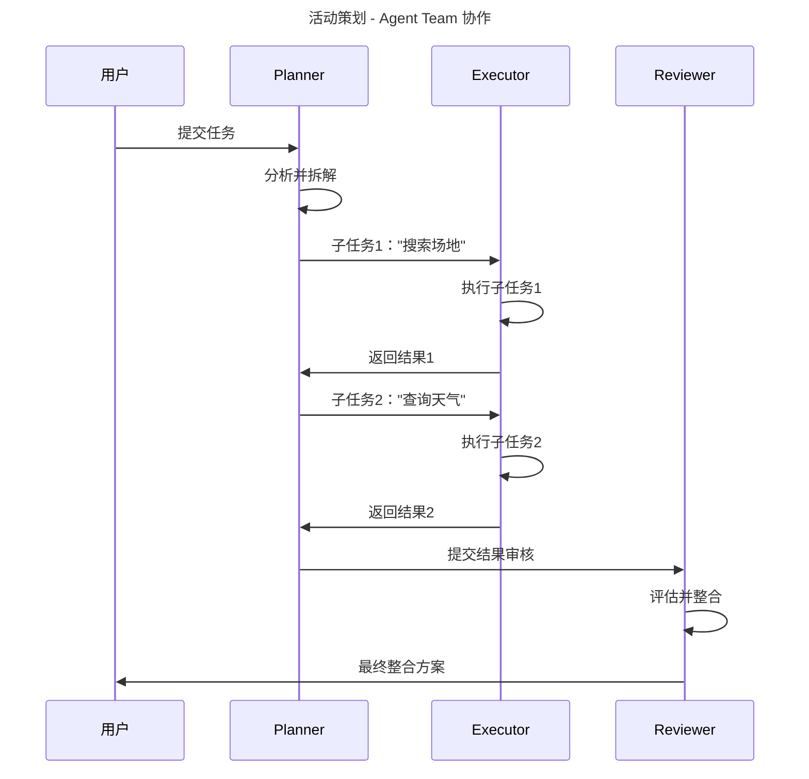

# EchoMind — AI Agent 平台

EchoMind 是一个模块化的 AI Agent 平台，基于 Spring Boot 3.3 / Java 17，支持 MCP 协议、插件式 Skill 市场和前端暗黑主题控制台。

## 技术架构

```
用户 / CLI / REST API
         |
   echomind-console (Web + CLI)
         |
   echomind-agent (编排器 + 5阶段管线)
    /    |    \        \
   /     |     \        \
LLM    Memory   MCP    Skill 市场
                |
          skill-filesystem (文件读写)
```

## 模块说明

| 模块 | 说明 |
|---|---|
| `echomind-common` | 共享模型（AgentMessage）、异常体系、JSON Schema 校验 |
| `echomind-skill-api` | Skill 接口规范 —— 零依赖纯 SPI |
| `echomind-llm` | 动态模型路由，支持 Anthropic / OpenAI 提供商 |
| `echomind-memory` | 短期对话窗口 + 长期持久化（Redis / 文件双模） |
| `echomind-mcp` | MCP 服务端（JSON-RPC）、客户端、工具适配器 |
| `echomind-skill` | Skill 注册中心、ClassLoader 隔离、市场管理 |
| `echomind-agent` | Agent 执行管线（5 阶段）、编排调度 |
| `echomind-agent-team` | 多 Agent 协作（Planner / Executor / Reviewer） |
| `echomind-console` | REST API + Vue 3 前端 + Spring Shell CLI |
| `echomind-boot` | Spring Boot 自动配置 |
| `echomind-app` | 应用启动入口 |
| `skill-weather` | 天气查询 Skill（wttr.in） |
| `skill-calculator` | 数学表达式计算 Skill（exp4j） |
| `skill-websearch` | 网页搜索 Skill（DuckDuckGo） |
| `skill-filesystem` | 文件读写 Skill（MCP 双模） |

## 快速开始

### 环境要求
- Java 17+
- Maven 3.8+
- 环境变量：`ANTHROPIC_API_KEY`、`ANTHROPIC_BASE_URL`

### 方式一：Docker Compose（推荐）

```bash
cd EchoMind
docker compose up -d
```

一键启动 MySQL + Redis + 后端 + 前端，访问 `http://localhost`。

服务清单：

| 服务 | 端口 | 说明 |
|------|------|------|
| mysql | 3306 | MySQL 8.3，数据持久化 |
| redis | 6379 | Redis 7，AOF 持久化 |
| backend | 8080 | Spring Boot 后端 |
| frontend | 80 | Vue 3 前端（Nginx） |

### 方式二：本地运行

```bash
# 构建
mvn clean package -DskipTests

# 启动后端
mvn -f echomind-app/pom.xml spring-boot:run

# 启动前端（新终端）
cd echomind-web
npm install
npm run dev
```

- 前端控制台：`http://localhost:5173`
- 后端 API：`http://localhost:8080`
- H2 控制台（开发环境）：`http://localhost:8080/h2-console`

## API 参考

| 方法 | 端点 | 说明 |
|---|---|---|
| `POST` | `/api/chat` | 发送消息给 Agent |
| `GET` | `/api/chat/{sessionId}/history` | 查询会话历史 |
| `GET` | `/api/models` | 列出可用模型 |
| `PUT` | `/api/models/switch` | 切换默认模型 |
| `GET` | `/api/skills` | 列出所有 Skill |
| `POST` | `/api/skills/upload` | 上传 Skill JAR 包 |
| `POST` | `/api/skills/{id}/enable` | 启用 Skill |
| `POST` | `/api/skills/{id}/disable` | 禁用 Skill |
| `DELETE` | `/api/skills/{id}` | 删除 Skill |
| `GET` | `/api/agents` | 列出所有 Agent |
| `POST` | `/api/agents` | 创建 Agent |
| `POST` | `/api/agents/{id}/execute` | 执行 Agent |
| `GET` | `/api/mcp/server` | MCP 服务端信息 |
| `GET` | `/api/mcp/tools` | 列出 MCP 工具 |
| `POST` | `/api/mcp/tools/{name}/call` | 调用 MCP 工具 |
| `GET` | `/api/memory/{sessionId}` | 查询会话记忆 |
| `DELETE` | `/api/memory/{sessionId}` | 清除会话记忆 |
| `GET` | `/api/teams` | 列出 Agent 团队 |
| `POST` | `/api/teams` | 创建团队 |
| `POST` | `/api/teams/{id}/execute` | 执行团队任务 |

## CLI 命令

```
echomind> chat --agent default "帮我查一下东京的天气"
echomind> models
echomind> model-switch --provider anthropic --model claude-opus-4-7
echomind> skill-list
echomind> agents
```

## Skill 开发指南

### 1. 在 `skills/` 下创建 Maven 模块

```xml
<dependency>
    <groupId>com.echomind</groupId>
    <artifactId>echomind-skill-api</artifactId>
    <scope>provided</scope>
</dependency>
```

### 2. 实现 Skill 接口

```java
public class MySkill implements Skill {
    @Override
    public SkillMetadata metadata() {
        return new SkillMetadata("my-skill", "1.0.0", "技能描述",
            Map.of(...), List.of(), "作者", List.of("标签"));
    }

    @Override
    public CompletableFuture<SkillResult> execute(SkillRequest request) {
        return CompletableFuture.supplyAsync(() -> {
            // 你的技能逻辑
            return SkillResult.success("输出结果", elapsedMs);
        });
    }
}
```

### 3. 配置 JAR Manifest

```xml
<plugin>
    <groupId>org.apache.maven.plugins</groupId>
    <artifactId>maven-jar-plugin</artifactId>
    <configuration>
        <archive>
            <manifestEntries>
                <EchoMind-Skill-Class>com.echomind.skill.example.MySkill</EchoMind-Skill-Class>
                <EchoMind-Skill-Version>1.0.0</EchoMind-Skill-Version>
            </manifestEntries>
        </archive>
    </configuration>
</plugin>
```

### 4. 构建并部署

```bash
mvn package -pl skills/skill-example
cp skills/skill-example/target/skill-example-1.0.0-SNAPSHOT.jar ./skills/
```

Skill 目录监听器会自动检测并热加载新的 Skill。

## Agent Team 协作

EchoMind 支持多 Agent 角色协作：

```
用户任务 → Planner（拆解）
              ↓
        Executor（执行子任务）
              ↓
        Reviewer（评估、整合）
              ↓
        最终输出 + Mermaid 流程图
```

### 演示场景：活动策划

```
输入："为60人策划一场公司户外团建活动"

Planner 拆解：
  1. 搜索场地选项
  2. 查询天气预报
  3. 估算预算
  4. 制定时间表

Executor 调用相关 Skill 处理每个子任务：
  - web-search → 场地选项
  - weather-query → 天气预报
  - calculator → 预算计算

Reviewer 评估所有结果，输出整合后的策划方案。
```

### 协作流程图



## 配置说明

默认 `application.yml`：

```yaml
echomind:
  models:
    default-provider: anthropic
    providers:
      anthropic:
        api-key: ${ANTHROPIC_API_KEY}
        base-url: ${ANTHROPIC_BASE_URL}
  memory:
    short-term-window: 20       # 短期窗口大小
    long-term-type: redis        # 长期存储：redis 或 file
    file-path: ./data/memory/    # 文件存储路径
    redis-ttl-seconds: 604800    # Redis 过期时间（7天）
  skill:
    auto-load-path: ./skills/    # Skill JAR 自动加载目录
    hot-reload: true             # 热加载开关
    marketplace-dir: ./data/marketplace/
  mcp:
    server-enabled: true         # 启用 MCP 服务
```

## 依赖方向

```
echomind-skill-api  ←  （零依赖，纯 SPI）
echomind-common     ←  （零依赖）
echomind-llm        ←  common + Spring AI
echomind-memory     ←  common
echomind-mcp        ←  common
echomind-skill      ←  skill-api, common, memory
echomind-agent      ←  skill-api, common, llm, memory, mcp, skill
echomind-agent-team ←  agent, skill-api
echomind-console    ←  agent, agent-team(可选), skill, mcp
echomind-boot       ←  console, agent, skill, llm, memory, mcp
echomind-app        ←  boot
skills/*            ←  skill-api（provided 作用域，隔离 ClassLoader）
```

## 技术栈

- **Java 17** — Records、Virtual Thread 就绪
- **Spring Boot 3.3.5** + Spring AI 1.0.0-M4
- **Spring Shell 3.3.3** — CLI 命令行
- **Vue 3 + Element Plus** — 前端控制台
- **MySQL 8.3** — 生产数据库（Docker Compose）
- **Redis 7** — 会话缓存与长期记忆
- **H2** — 本地开发数据库
- **Maven 3.8.6** — 多模块构建
- **MCP 协议 2024-11-05** — 外部工具集成

## 开源协议

本项目仅用于学习和演示目的。
