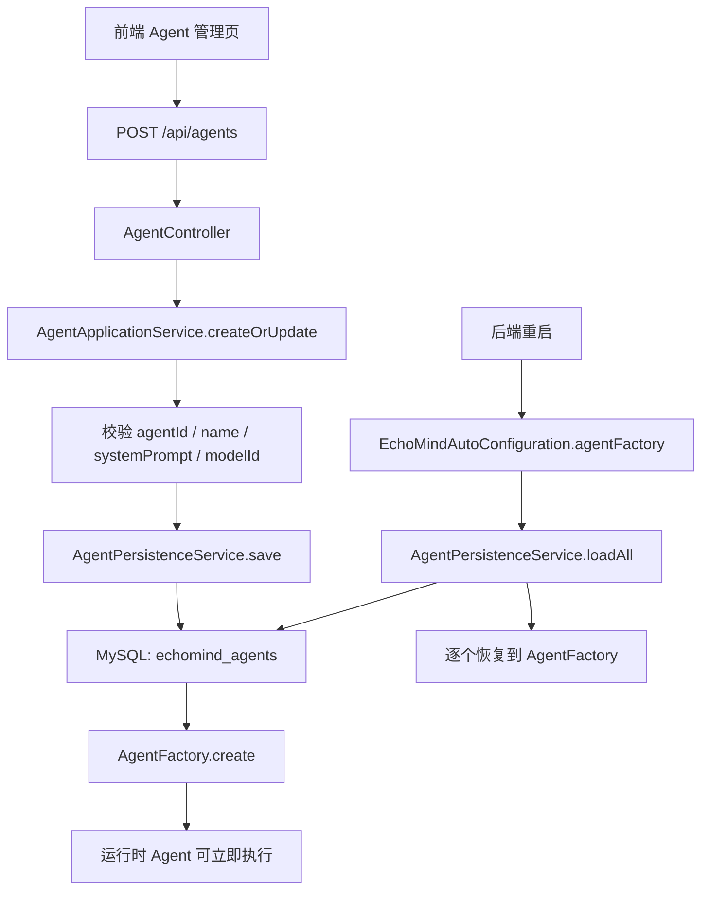
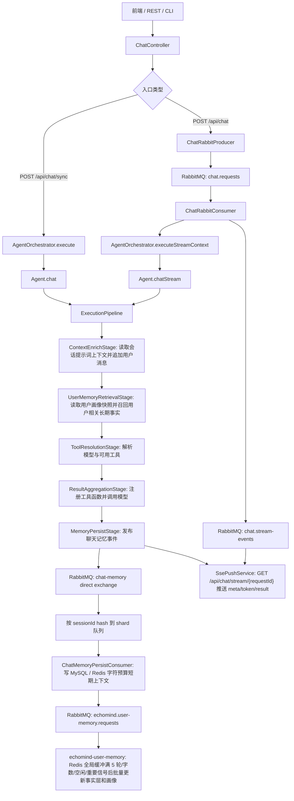
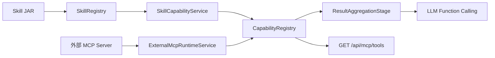
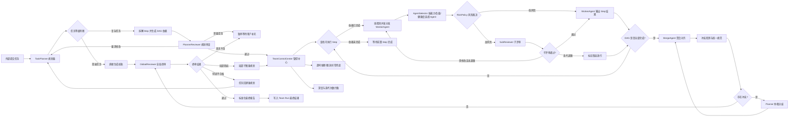

# EchoMind — AI Agent 平台

EchoMind 是一个模块化的 AI Agent 平台，基于 Spring Boot 3.5 / Java 17，支持 MCP 协议、插件式 Skill 市场和前端暗黑主题控制台。

当前 Docker Compose 默认部署业务依赖、前后端、OpenTelemetry Collector 和 Jaeger。后端已内置
OpenTelemetry Spring Boot Starter 和 EchoMind 业务 Span，本地默认导出新产生的聊天链路，项目三
管理端可直接查询 Trace、Token、脱敏和告警等后台能力；客户端 `http://localhost`
保持原有对话、Agent、Skill、MCP、Team 工作台。

## 技术架构

```
用户 / CLI / REST API
         |
   echomind-console (Controller + ApplicationService + CLI)
         |
   echomind-agent (编排器 + Pipeline + Capability)
    /    |    \        \
   /     |     \        \
LLM    Memory   MCP    Skill 市场
```

### 架构边界

EchoMind 现在按“管理面 MVC + 智能执行 Pipeline + 工具能力注册表”的方式组织：

| 层 | 代表类 | 责任 |
|---|---|---|
| HTTP / CLI 边界 | `AgentController`、`ChatController`、`EchoMindShell` | 接收请求、解析参数、返回 DTO，不直接拼业务流程 |
| 应用服务层 | `AgentApplicationService`、`ChatApplicationService` | 编排用例，负责校验、事务顺序、运行时同步；聊天请求归一化、队列流式消费和会话清理由同层 helper 承接 |
| 运行时层 | `AgentOrchestrator`、`ExecutionPipeline`、`CapabilityRegistry` | 执行 Agent、模型路由、工具注册和调用 |
| 持久化层 | `AgentRepository`、`SkillEntityRepository`、`ChatMessageRepository` | 保存配置和完整会话消息，服务前端展示与审计 |

需要长期保留的数据必须进入持久化层。`AgentFactory`、`SkillRegistry`、`CapabilityRegistry`
只做运行时索引，不能作为事实来源；重启后会从 MySQL 或 Skill 目录重新恢复。

### 后端结构速读

后端不是纯 Clean Architecture，也不是把所有能力拆成微服务；当前形态是一个模块化单体：

```text
echomind-console
  Controller / Application Service / Admin Governance
        |
echomind-agent
  AgentOrchestrator -> Agent -> ExecutionPipeline
        |
        +-- ToolRouter -> ToolCompatibilityPolicy / ToolMatchScorer / ToolDisambiguationPolicy
        +-- CapabilityRegistry -> SkillToolAdapter / MCPToolProviderAdapter
        +-- ResultAggregationStage -> LLM Provider function calling
        +-- MemoryPersistStage -> RabbitMQ async persistence
        |
echomind-llm / echomind-memory / echomind-mcp / echomind-skill
  Provider / Store / External MCP Client / Skill Runtime
```

实践规则：

- Controller 只做 HTTP 适配，不拼 Agent 调用链路。
- Application Service 做用例编排，包括校验、持久化顺序、运行时索引同步和治理钩子。
- Runtime 模块只处理执行能力：Agent Pipeline、工具路由、模型调用、记忆读写。
- Provider 通过 Spring AI 适配 OpenAI-compatible 和 DeepSeek Chat Completions 协议，但仍只暴露 EchoMind 自己的 `ModelProvider` seam；它不认识 `12306`、`travel-planning` 这类具体业务工具名。
- Skill/MCP 工具通过 metadata 自描述能力；平台只读取 tags、keywords、aliases、schema 和 domain hints。

### 数据事实来源

| 数据 | 事实来源 | 运行时缓存/索引 |
|---|---|---|
| Agent 配置 | MySQL `echomind_agents` | `AgentFactory` |
| Skill 元数据和启停状态 | MySQL `echomind_skills` + Skill JAR | `SkillRegistry`、`CapabilityRegistry` |
| 当前对话记忆 | MySQL `echomind_chat_sessions` / `echomind_chat_messages`，按 `userId + sessionId` 保存完整历史，用于前端历史展示 | Redis `echomind:memory:recent:*` 按字符预算保存短期上下文，`short-term-window` 只做最大条数兜底 |
| 用户长期记忆 | Redis Stack `idx:user:memory:vectors` 按 `userId` 保存细粒度事实；Redis `echomind:user-profile:snapshot:*` 保存固定长度用户画像快照 | 主应用 Pipeline 同步读取画像快照并 KNN 召回相关事实 |
| 管理端账号 | MySQL `echomind_admin_users` | 管理端独立 JWT，不和客户端 `echomind_users` 混用 |
| AI 调用用量 | MySQL `echomind_ai_call_usage` | OpenTelemetry Span tag 和管理端 Token 仪表盘 |
| 敏感数据规则和事件 | MySQL `echomind_sensitive_rules` / `echomind_sensitive_events`，只保存脱敏后样本 | `ChatApplicationService` 请求前和响应后治理钩子 |
| 告警规则和事件 | MySQL `echomind_alert_rules` / `echomind_alert_events` | 飞书自定义机器人 Webhook 推送、静默期和累计升级判断 |
| Agent 知识库 | MySQL 保存文档元数据；Milvus `echomind_agent_knowledge` 保存切片正文、切片序号和向量 | `KnowledgeRetrievalStage` 只走 Milvus，并按命中片段扩展前后 5 个切片窗口 |
| 工具可用性 | 已启用 Skill + 已挂载外部 MCP 服务 | `CapabilityRegistry` |

### Agent 创建与恢复链路



创建 Agent 时会先写 MySQL，再刷新运行时 `AgentFactory`。如果同一个 `agentId` 再次提交，
会覆盖数据库中的配置并刷新运行时 Agent。后端重启时，自动配置会先读取
`echomind_agents`，再补齐配置文件中声明但数据库没有的默认 Agent。启动期默认 Skill 补齐、
旧模型 ID 迁移和退役 Skill 清理由 `echomind.runtime` 声明，`AgentRuntimeBootstrapper`
只执行这些配置化规则，不再在启动流程里硬编码具体 Skill 或旧模型。

## 调用链路

### 聊天主链路



聊天接口会先从 `Authorization: Bearer ...` 解析当前用户；客户端 token 是 HS256 JWT，后端
`AuthFilter` 校验签名、过期时间和账号状态后写入 `AuthContext` ThreadLocal，并在请求结束清理。
无 token 的兼容请求归属 `default` 用户。同步请求走 `POST /api/chat/sync`，`ChatController` 创建或复用前端 `sessionId` 后，调用
`AgentOrchestrator.execute(userId, agentId, sessionId, message, ...)`。编排器根据 `agentId` 找到 Agent，
组装 `PipelineContext`，再交给 `Agent.chat()` 执行完整管线。

异步请求走 `POST /api/chat`，控制器只生成 `requestId` 并把 `ChatRequest` 投递到 RabbitMQ。
`ChatRabbitConsumer` 消费后执行流式 Agent 管线，并把 meta、token、最终结果或失败发布到
`echomind.chat.stream-events`；`SsePushService` 只通过 `GET /api/chat/stream/{requestId}` 转发事件给前端，
不直接执行模型调用。这样前端仍有逐 token 体验，但模型执行由 RabbitMQ 队列削峰。
OpenAI 兼容 Provider（OpenAI、阿里云百炼/Qwen、Ollama、vLLM 等）和 DeepSeek Provider
都通过 Spring AI ChatModel adapter 调用 Chat Completions，并把 Spring AI 返回的文本、流式
片段、工具回调和原生 usage 转回 EchoMind 的 `ProviderResponse` / `ProviderStreamChunk`。
Mock Provider 仍只返回单段模拟结果。

### 管线阶段

| 顺序 | 阶段 | 责任 |
|---|---|---|
| 10 | `ContextEnrichStage` | 使用 `ctx.getMemoryKey()` 读取会话提示词上下文，把用户本轮消息加入上下文 |
| 12 | `UserMemoryRetrievalStage` | 按 `userId` 读取 Redis 用户画像快照，并从 Redis Stack 召回本轮相关长期事实 |
| 16 | `KnowledgeRetrievalStage` | 用查询向量只检索 Milvus 知识库；命中中心片段后扩展同文档前后 5 个切片 |
| 20 | `ToolResolutionStage` | 根据 Agent 默认模型或请求参数选择模型，写入 `modelId` 和 typed `resolvedModel` |
| 40 | `ResultAggregationStage` | 复用已解析模型，委托 helper 构造 prompt、暴露工具和 `ProviderRequest`，再调用选中的 Provider |
| 50 | `MemoryPersistStage` | 把用户消息、工具结果与最终助手回复发布到聊天记忆异步写入队列 |

当前普通聊天记忆按登录用户和一次对话隔离：`PipelineContext.getMemoryKey()` 返回
`userId:sessionId`，MySQL 会话主表使用 `user_id + session_id` 复合主键；旧的无 token
请求和历史数据统一归属 `default` 用户。`agentId` 只表示本轮由哪个 Agent 执行，不会再让多个
会话共享同一份 Agent 记忆。第一阶段只隔离普通聊天会话和记忆，Agent、Skill、MCP、Team 仍是全局资源。

普通聊天历史写入是异步的：`MemoryPersistStage` 只发布事件，后台
`ChatMemoryPersistConsumer` 再写 MySQL 完整历史、Redis 短期上下文字数预算缓存，并把本轮消息交给
`echomind-user-memory`。用户记忆 worker 按用户全局缓冲，满足 5 轮、字数上限、空闲超时或主模型
重要性信号时触发 flush；flush 只作为后台触发信号，真正事实仍由 worker 基于旧画像、缓冲对话和
相关旧事实一次调用 LLM 产出 add/update/delete 以及新版用户画像快照。普通聊天消息不再写入
Redis Stack 向量索引。
Agent 知识库上传时先按段落切片，超限再按标点切片，仍超限才硬切；默认单片预算 500 字符，
前文重叠比例约 15%。知识库检索不查询 MySQL chunk/keyword，只从 Milvus 命中中心片段并扩展
同文档附近 5 个切片。
该队列按 `sessionId` hash 到多个分片队列，每个分片固定单消费者；高并发扩容应增加
`echomind.memory.persist-shards`，不要把单个分片改成多消费者，否则同一会话可能乱序。

### Skill、外部 MCP 与工具能力链路

Skill 由 `SkillDirectoryWatcher` 加载到 `SkillRegistry`，随后 `SkillCapabilityService`
会把已启用 Skill 同步到 `CapabilityRegistry`，供 Agent 对话时调用。

外部 MCP Server 由 `ExternalMcpRuntimeService` 管理：启动时会挂载配置文件里的
`echomind.mcp.external-servers`，运行时也可以通过前端 MCP 管理页或 REST 接口动态挂载、
刷新和卸载。挂载成功后，它的工具会进入同一个 `CapabilityRegistry`，模型函数调用可以
像使用本地 Skill 一样使用这些外部工具。



工具调用采用“动态关键词优先，模型兜底”的策略：`ToolExposurePlanner` 会先让 `ToolRouter`
在当前 Agent 允许的工具范围内按工具元数据打分匹配。强信号来自 Skill JAR
自带的 `keywords`、`aliases`、`tags` 和工具名；描述和参数 Schema 只作为弱信号，避免误收窄。
如果达到强匹配阈值，就只把命中的工具转换为模型函数定义，模型再根据工具描述和参数 Schema
自主决定是否调用；如果没有强命中，才把当前 Agent 允许的全部工具交给模型智能判断。
对 URL 场景有额外防线：`http/https` 链接会强命中带 `web/search/lookup` 标签的通用网页工具；
域名专用工具通过 `domain:`、`host:` 或 `url-host:` metadata 提示声明适用域名，只在 URL 域名匹配时暴露。
兼容旧 MCP 的 Nowcoder 识别仍保留为兜底，但新增专站工具应优先声明 host hint。
禁用 Skill 后，它会从能力注册表移除，旧对话也不能继续调用已禁用工具。
Provider 层不再按 `weather`、`12306` 等具体工具名猜参数或决定最终答案策略；Spring AI
负责模型 tool-calling 协议，EchoMind 的工具回调仍会按 `parameterSchema` 校验 JSON 参数。
工具输出如果已经是可直接交付文本，Skill 可在 tags 中声明 `direct-result` 或 `final-answer`，
`ProviderRequestFactory` 会把该能力透传给 LLM Provider。

工具路由内部按职责拆分：

| Module | 责任 |
|---|---|
| `ToolRouter` | 工具注册、Agent allow-list、filter/match 入口委托、直调执行 |
| `ToolCompatibilityPolicy` | URL/domain 兼容性过滤和 URL 意图加权 |
| `ToolMatchScorer` | keywords、aliases、tags、schema、描述文本打分 |
| `ToolDisambiguationPolicy` | 铁路/日期等易误触发场景的确定性消歧 |
| `ToolParameterExtractor` | REST/CLI 直调时从用户文本兜底提取参数 |
| `ToolRoutingMetadata` | 路由共享的 metadata 读取和 enum alias |

新 Skill JAR 推荐在 `SkillMetadata` 中填写 `keywords` 和 `aliases`，例如
`keywords=["发票审核","报销","invoice audit"]`、`aliases={"invoice":["发票","票据"]}`。
如果是专站 URL 工具，建议在 tags 或 keywords 中加入 `host:example.com`；如果是最终报告型工具，
建议加入 `direct-result`。这样新领域工具可以自己带触发词和路由提示，不需要修改平台代码。

MCP 的 REST 管理入口在 `/api/mcp` 下：`GET /api/mcp/servers` 查看已挂载服务，
`POST /api/mcp/servers` 动态挂载 stdio MCP Server，`DELETE /api/mcp/servers/{id}` 卸载服务，
`POST /api/mcp/servers/{id}/refresh` 重新读取工具列表。`GET /api/mcp/tools` 只列出外部 MCP 工具，
`POST /api/mcp/tools/{name}/call` 可直接调用这些外部工具。

### Agent Team 链路

团队任务从 `TeamController` 创建异步 Run，`TeamBlackboardService` 将 Team、Run、Step、Event 写入
MySQL 黑板，再由 `TaskExecutor` 后台推进状态机。Planner 结构化拆解 Step，Reviewer 先审查计划，
Executor 按能力标签并发执行，Reviewer 再对照初始需求审查结果、触发 Step 重试、结果阶段 replan 或澄清，并生成最终报告。
每个角色最终仍通过 `AgentOrchestrator -> Agent -> ExecutionPipeline` 执行，但角色之间通过黑板交换上下文。

## 模块说明

| 模块 | 说明 |
|---|---|
| `echomind-common` | 共享模型（AgentMessage）、异常体系、JSON Schema 校验 |
| `echomind-skill-api` | Skill 接口规范 —— 零依赖纯 SPI |
| `echomind-llm` | 动态模型路由，基于 Spring AI adapter 接入 DeepSeek、OpenAI 兼容 Provider 和阿里云百炼 |
| `echomind-memory` | MySQL 完整会话历史供前端展示 + Redis 最近上下文供 LLM 读取 + Milvus Agent 知识库向量检索，普通聊天记忆按 `userId + sessionId` 隔离 |
| `echomind-user-memory` | RabbitMQ 异步消费聊天事件，按用户缓冲 5 轮后批量更新 Redis Stack 用户事实和 Redis 用户画像快照 |
| `echomind-mcp` | 外部 MCP 客户端、stdio 传输客户端、工具适配器 |
| `echomind-skill` | Skill 注册中心、ClassLoader 隔离、市场管理 |
| `echomind-agent` | Agent 执行管线、编排调度、Agent MySQL 持久化、统一能力注册 |
| `echomind-agent-team` | 多 Agent 协作（Planner / Executor / Reviewer） |
| `echomind-console` | REST API + 应用服务层 + Vue 3 前端 + Spring Shell CLI |
| `echomind-boot` | Spring Boot 自动配置 |
| `echomind-app` | 应用启动入口 |
| `skill-weather` | 天气查询 Skill（wttr.in） |
| `skill-calculator` | 数学表达式计算 Skill（exp4j） |
| `skill-websearch` | 网页搜索/公开 URL 读取 Skill（SearXNG + JSoup） |
| `skill-markdown-code` | Markdown 代码块格式化 Skill |
| `skill-date-query` | 日期、时间、星期查询 Skill |
| `skill-github-intel` | GitHub 仓库、Release、Issue 和仓库搜索情报 Skill |
| `skill-railway-12306` | 12306 国内列车时刻、余票、票价、中转换乘和站点查询 Skill |
| `skill-travel-planning` | 多城市路线、预算、打包清单和签证时间表规划 Skill |

## 快速开始

### 环境要求
- Java 17+
- Maven 3.8+
- Node.js 18+ / npm（仅前端本地开发需要）
- Docker Desktop（推荐部署和 MySQL / Redis / RabbitMQ / Jaeger 本地依赖）
- 常用环境变量：`DEEPSEEK_API_KEY`、`DEEPSEEK_BASE_URL`、`ALIYUN_BAILIAN_API_KEY`、`Webhook`、OSS 相关 AccessKey

### 方式一：Docker Compose（推荐）

```bash
cd EchoMind
docker compose up -d
```

一键启动 MySQL + Redis + 后端 + 前端，访问 `http://localhost`。

服务清单：

| 服务 | 端口 | 说明 |
|------|------|------|
| mysql | 3306 | MySQL 8.3，数据持久化 |
| redis | 6379 | Redis Stack，近期上下文缓存 + 用户长期事实向量 |
| milvus | 19530 / 9091 | Milvus Standalone，Agent 知识库切片正文和向量检索 |
| rabbitmq | 5672 / 15672 | 异步聊天消息队列与管理台 |
| backend | 8080 | Spring Boot 后端 |
| frontend | 80 | Vue 3 前端（Nginx） |
| admin-frontend | 8081 | 项目三管理端前端（Nginx） |

如果 Docker 构建环境访问 Maven Central 不稳定，可以先用本机 Maven 打生产包，再使用运行镜像
Dockerfile 部署后端：

```powershell
powershell -NoProfile -ExecutionPolicy Bypass -File .\scripts\deploy-runtime.ps1
```

`Dockerfile.runtime` 只复制 `echomind-app/target` 和 `skills/*/target` 中的产物，不在容器内下载
Maven 依赖；常规 CI 或网络稳定环境仍可继续使用默认 `Dockerfile` 的多阶段构建。
Windows 上用 `scripts/deploy-runtime.ps1` 部署时会先执行 `scripts/load-compose-env.ps1`，
把用户/系统环境变量导入当前部署进程，避免 `Webhook` 等变量在 Docker Compose 展开时变成空值。
`docker/mysql/init.sql` 只会在 MySQL volume 首次创建时执行；已有 volume 升级必须先运行
`scripts/apply-mysql-migrations.ps1`。脚本按文件名顺序执行 `docker/mysql/migrations/*.sql`，
并用 MySQL 表 `echomind_schema_migrations` 记录已应用版本和校验和。

### 方式二：本地运行

```powershell
# 构建
mvn.cmd -q -DskipTests compile

# 启动后端
mvn.cmd -f echomind-app/pom.xml spring-boot:run

# 启动前端（新终端）
cd echomind-web
npm.cmd install
npm.cmd run dev
```

- 前端控制台：`http://localhost:5173`
- 后端 API：`http://localhost:8080`
- H2 控制台（开发环境）：`http://localhost:8080/h2-console`

客户端和管理端登录态均为后端签发的 HS256 JWT access token。修改
`ECHOMIND_AUTH_TOKEN_SECRET` 或 `ECHOMIND_ADMIN_TOKEN_SECRET`，或从旧自定义 token 版本升级后，
浏览器里的旧 token 会失效，需要重新登录。

## API 参考

| 方法 | 端点 | 说明 |
|---|---|---|
| `POST` | `/api/auth/login` | 用户名密码登录，返回 token 和当前用户 |
| `POST` | `/api/auth/register` | 注册普通登录用户 |
| `POST` | `/api/auth/logout` | 登出占位接口，前端清理本地 token |
| `GET` | `/api/auth/me` | 查询当前认证用户；无 token 时返回 default 兼容用户 |
| `POST` | `/api/auth/avatar` | 上传当前用户头像，图片进入对象存储，大小不超过 2MB |
| `POST` | `/api/admin/auth/login` | 管理端账号登录，返回独立 admin token |
| `GET` | `/api/admin/auth/me` | 查询当前管理端用户 |
| `POST` | `/api/admin/auth/logout` | 管理端登出占位接口 |
| `GET` | `/api/admin/dashboard` | 查询管理端仪表盘真实汇总、模型分布、Token 趋势和最近调用 |
| `GET` | `/api/admin/usage/summary` | 查询所有客户端用户的总 Token 和调用次数 |
| `GET` | `/api/admin/usage/users` | 查询客户端用户列表及每个用户累计 Token |
| `GET` | `/api/admin/usage/users/{userId}/calls` | 查询指定客户端用户的调用明细、TraceID 和 Token 花费 |
| `GET` | `/api/admin/quotas` | 查询客户端用户 Token 配额和当前使用比例 |
| `PUT` | `/api/admin/quotas/users/{userId}` | 更新客户端用户日/月 Token 限额和预警阈值 |
| `GET` | `/api/admin/sensitive/rules` | 查询敏感数据脱敏/阻断规则 |
| `PUT` | `/api/admin/sensitive/rules` | 更新敏感数据规则 |
| `GET` | `/api/admin/sensitive/events` | 查询敏感数据命中事件，样本已脱敏 |
| `GET` | `/api/admin/alerts/rules` | 查询告警规则、阈值、静默期、升级策略和后端 `Webhook` 生效状态 |
| `PUT` | `/api/admin/alerts/rules` | 更新告警规则 |
| `GET` | `/api/admin/alerts/events` | 查询告警事件、升级状态、飞书推送状态和建议动作 |
| `GET` | `/api/admin/client-users` | 查询客户端用户列表、状态和数据规模 |
| `PUT` | `/api/admin/client-users/{userId}/status` | 管理端封禁或解封客户端账号 |
| `DELETE` | `/api/admin/client-users/{userId}` | 硬删除客户端账号及其聊天、用量、配额和记忆缓存 |
| `GET` | `/api/observability/traces` | 查询 Jaeger Trace，支持 `scope=business` 和 `userId` 过滤 |
| `GET` | `/api/observability/traces/{traceId}` | 查询单条 Trace 的完整 Span 树 |
| `POST` | `/api/chat` | 异步发送消息，返回 requestId 和 sessionId |
| `GET` | `/api/chat/stream/{requestId}` | 订阅异步最终结果 SSE |
| `POST` | `/api/chat/sync` | 同步执行 Agent 并返回完整回复 |
| `POST` | `/api/chat/stream` | 直接流式执行，逐 token 返回 SSE |
| `GET` | `/api/chat/sessions` | 列出有记忆的会话摘要 |
| `GET` | `/api/chat/{sessionId}/history` | 查询会话历史 |
| `DELETE` | `/api/chat/{sessionId}` | 删除单条会话历史并回收关联附件 |
| `GET` | `/api/models` | 列出可用模型 |
| `PUT` | `/api/models/switch` | 切换默认模型 |
| `GET` | `/api/skills` | 列出所有 Skill |
| `POST` | `/api/skills/upload` | 上传 Skill JAR 包 |
| `POST` | `/api/skills/{id}/enable` | 启用 Skill |
| `POST` | `/api/skills/{id}/disable` | 禁用 Skill |
| `DELETE` | `/api/skills/{id}` | 删除 Skill |
| `GET` | `/api/agents` | 列出所有 Agent |
| `POST` | `/api/agents` | 创建或覆盖 Agent，并写入 MySQL |
| `POST` | `/api/agents/{id}/execute` | 执行 Agent |
| `GET` | `/api/mcp/servers` | 列出已挂载外部 MCP 服务 |
| `POST` | `/api/mcp/servers` | 动态挂载外部 stdio MCP 服务 |
| `POST` | `/api/mcp/servers/{id}/refresh` | 刷新外部 MCP 服务工具列表 |
| `DELETE` | `/api/mcp/servers/{id}` | 卸载外部 MCP 服务 |
| `GET` | `/api/mcp/tools` | 列出外部 MCP 工具 |
| `POST` | `/api/mcp/tools/{name}/call` | 调用外部 MCP 工具 |
| `GET` | `/api/memory/{sessionId}` | 查询会话记忆 |
| `DELETE` | `/api/memory/{sessionId}` | 清除会话记忆 |
| `GET` | `/api/teams` | 列出 Agent 团队 |
| `POST` | `/api/teams` | 创建团队，Reviewer 必填 |
| `DELETE` | `/api/teams/{id}` | 硬删除团队及其 Run/Step/Event 黑板记录 |
| `POST` | `/api/teams/{id}/runs` | 创建异步团队 Run |
| `GET` | `/api/teams/{id}/runs` | 查询当前用户在团队下的 Run |
| `GET` | `/api/teams/{id}/runs/{runId}` | 查询 Run 黑板、Step 和事件 |
| `POST` | `/api/teams/{id}/runs/{runId}/resume` | 提交澄清信息并继续 Run |
| `GET` | `/api/team-runs` | 查询当前用户 Team Run 历史，与普通聊天历史分离 |

聊天、会话列表、历史查询、会话删除和 `/api/memory/{sessionId}` 都以后端认证上下文中的用户为准；
前端或调用方不需要也不能提交可信 `userId`。默认登录账号可通过
`ECHOMIND_AUTH_DEFAULT_USERNAME` / `ECHOMIND_AUTH_DEFAULT_PASSWORD` 配置，未配置时为 `admin` / `admin123`。
用户头像 URI 保存到 MySQL `echomind_users.avatar_uri`，文件经 `ObjectStorageService` 写入 OSS 或本地兜底存储，
`/api/auth/me` 返回可展示的短期 URL。

项目三管理端账号单独使用 `echomind_admin_users` 和 `/api/admin/auth/*`，客户端账号继续使用
`echomind_users` 和 `/api/auth/*`；两类 token 不互认。管理端用量接口只统计客户端调用数据，
不会把管理端登录、刷新页面或查询 Trace 当作用户调用消费。

## CLI 命令

```
echomind> chat --agent default "帮我查一下东京的天气"
echomind> models
echomind> model-switch --provider deepseek --model deepseek-v4-flash
echomind> skill-list
echomind> agents
```

## Skill 开发指南

### 1. 在 `skills/` 下创建 Maven 模块

```xml
<dependency>
    <groupId>com.echomind</groupId>
    <artifactId>echomind-skill-api</artifactId>
    <scope>provided</scope>
</dependency>
```

### 2. 实现 Skill 接口

```java
public class MySkill implements Skill {
    @Override
    public SkillMetadata metadata() {
        return new SkillMetadata("my-skill", "1.0.0", "技能描述",
            Map.of(...),
            List.of(),
            "作者",
            List.of("标签", "direct-result"),
            List.of("触发词", "domain term"),
            Map.of("canonical", List.of("别名1", "别名2")));
    }

    @Override
    public CompletableFuture<SkillResult> execute(SkillRequest request) {
        return CompletableFuture.supplyAsync(() -> {
            // 你的技能逻辑
            return SkillResult.success("输出结果", elapsedMs);
        });
    }
}
```

### 3. 配置 JAR Manifest

```xml
<plugin>
    <groupId>org.apache.maven.plugins</groupId>
    <artifactId>maven-jar-plugin</artifactId>
    <configuration>
        <archive>
            <manifestEntries>
                <EchoMind-Skill-Class>com.echomind.skill.example.MySkill</EchoMind-Skill-Class>
                <EchoMind-Skill-Version>1.0.0</EchoMind-Skill-Version>
            </manifestEntries>
        </archive>
    </configuration>
</plugin>
```

### 4. 构建并部署

```bash
mvn package -pl skills/skill-example
cp skills/skill-example/target/skill-example-1.0.0-SNAPSHOT.jar ./skills/
```

Skill 目录监听器会自动检测并热加载新的 Skill。

## Agent Team 协作

EchoMind 支持多 Agent 角色协作。Team 定义是全局资源；每次 Run、Step 和 Event 按当前用户写入 MySQL，
作为团队共享黑板，不进入普通聊天会话历史。Team Run 由 `TaskExecutor` 后台异步推进，前端 Team 看板 0.25 秒轮询展示进度。

```
用户任务 → Planner（结构化拆解 Step）
              ↓
        Reviewer（规划后审查）
              ↓
        TeamControlCenter（DAG 依赖调度）
              ↓
        多 Executor（可并发的 Step 并发执行）
              ↓
        SubReviewer（高风险 Step 子评审，可选）
              ↓
        MergeAgent（聚合对齐）→ ConflictDetector（冲突检测）→ PlannerArbitration（必要时仲裁）
              ↓
        GlobalReviewer（终审 / 重试 / 局部重规划 / 整体重规划 / 澄清 / 最终报告）
              ↓
        Run 看板 + 中文 DAG 流程图 + Markdown 下载
```

### 演示场景：活动策划

```
输入："为60人策划一场公司户外团建活动"

Planner 拆解 DAG：
  1. 搜索场地选项
  2. 查询天气预报
  3. 基于场地和天气估算预算
  4. 基于前置结果制定时间表

Agent 不是由硬编码规则直接指定。Planner 先输出 `requiredCapabilities`、`dependsOn` 和 `riskLevel`；
TeamControlCenter 把候选 Executor、能力标签、负载和健康度交给模型做自主选择，规则评分只作为兜底。
风险策略再决定是否进入 SubReviewer。
MergeAgent 聚合后会进入 ConflictDetector；若预算、日期、地点等口径冲突，Planner 先仲裁，MergeAgent 再二次聚合。

Executor 按能力标签分配并调用相关 Skill 处理每个子任务：
  - web-search → 场地选项
  - weather-query → 天气预报
  - calculator → 预算计算

Reviewer 先审查 Planner 拆解是否覆盖初始需求，再对比所有 Executor 原始结果。
如果单个结果不合格，Reviewer 返回 `RETRY` 并点名重跑指定 Step；如果只需要重跑局部分支，
返回 `PARTIAL_REPLAN`；如果 Step 结构本身缺失或拆解方向错误，返回 `REPLAN` 重新规划，默认最多 1 次。
每次重试都会写入 Reflexion：失败原因、修改意见、上一轮输出摘要会进入 Step 黑板并带回 Executor。
如果需求有歧义，返回 `ASK_CLARIFICATION` 暂停 Run；通过后输出完整策划方案。
```

### 协作流程图



## 配置说明

默认 `application.yml`：

```yaml
echomind:
  auth:
    token-secret: ${ECHOMIND_AUTH_TOKEN_SECRET:echomind-dev-secret}
    token-ttl-seconds: ${ECHOMIND_AUTH_TOKEN_TTL_SECONDS:604800}
  admin:
    token-secret: ${ECHOMIND_ADMIN_TOKEN_SECRET:echomind-admin-dev-secret}
    token-ttl-seconds: ${ECHOMIND_ADMIN_TOKEN_TTL_SECONDS:604800}
  models:
    default-provider: deepseek
    providers:
      deepseek:
        api-key: ${DEEPSEEK_API_KEY}
        base-url: ${DEEPSEEK_BASE_URL:https://api.deepseek.com}
        models:
          - name: deepseek-v4-flash
            capabilities: [text, function]
            default: true
      aliyun-bailian:
        api-key: ${ALIYUN_BAILIAN_API_KEY}
        base-url: ${ALIYUN_BAILIAN_BASE_URL:https://dashscope.aliyuncs.com/compatible-mode/v1}
        models:
          - name: qwen3.7-max
            capabilities: [text, function]
            default: true
          - name: qwen3.6-plus
            capabilities: [text, function, vision]
          - name: qwen3.6-flash
            capabilities: [text, function]
          - name: qwen3.5-omni-plus
            capabilities: [text, vision]
          - name: qwen-vl-plus
            capabilities: [text, vision]
          - name: qwen-vl-max
            capabilities: [text, vision]
  memory:
    short-term-window: 80       # Redis 短期上下文最大条数兜底
    short-term-max-chars: 12000 # Redis 单会话短期上下文总字数预算
    short-term-message-max-chars: 1500 # 单条消息进入 Redis 短期上下文前的最大字数
    redis-ttl-seconds: 604800   # Redis 近期缓存过期时间（7天）
    embedding-enabled: true
    embedding-model: tongyi-embedding-vision-plus
    persist-queue-name: echomind.chat-memory.persist.requests
    persist-exchange-name: echomind.chat-memory.persist.exchange
    persist-shards: 8           # 按 sessionId hash 分片，每个分片单消费者，避免同会话乱序
    async-persist-enabled: true
    summary-refresh-interval: 6
  user-memory:
    batch-size: 5               # 用户全局缓冲满 5 轮后批量沉淀长期记忆
    buffer-max-chars: 8000      # 未满 5 轮但缓冲字数超限时也会触发 flush
    buffer-idle-flush-seconds: 1800
    related-fact-top-k: 12
    profile-max-chars: 2000
  skill:
    auto-load-path: ./skills/    # Skill JAR 自动加载目录
    hot-reload: true             # 热加载开关
    marketplace-dir: ./data/marketplace/
  mcp:
    external-servers:            # 启动时自动挂载的外部 MCP 服务
      - id: nowcoder-java-interview
        enabled: true
        transport: stdio
        command: [java, -jar, ./mcp/nowcoder-java-interview-mcp-server-1.0.0.jar]
        working-directory: ./mcp
  runtime:
    agent-bootstrap:
      default-skill-merge-ids: [markdown-code, date-query, github-intel, 12306, travel-planning]
      model-migrations:
        - from-prefix: anthropic:claude-
          to-model-id: deepseek:deepseek-v4-flash
        - from-prefix: openai:gpt-
          to-model-id: deepseek:deepseek-v4-flash
        - from: deepseek:deepseek-chat
          to-model-id: deepseek:deepseek-v4-flash
    retired-skills:
      skill-ids: [qq-mail]
```

## 测试与部署

常用验证命令：

```bash
# 本地编译
mvn -q -DskipTests compile

# 全量测试。如果本机 Maven 镜像异常，可使用 Docker Maven 避免本地 settings.xml 干扰。
mvn -q test
docker run --rm -v "D:\claudeWorkSpace\ai-agent:/workspace" -w /workspace \
  maven:3.9-eclipse-temurin-17 mvn -q test

# 重建并部署前后端
mvn -q clean package -Dmaven.test.skip=true
docker build -f Dockerfile.runtime -t ai-agent-backend:latest .
docker build -f echomind-web/Dockerfile.runtime -t ai-agent-frontend:latest echomind-web
docker build -f echomind-web/Dockerfile.admin-runtime -t ai-agent-admin-frontend:latest echomind-web
powershell -NoProfile -ExecutionPolicy Bypass -File scripts/apply-mysql-migrations.ps1 -StartDatabase
docker compose up -d --remove-orphans backend frontend admin-frontend otel-collector jaeger

# 验证服务和 Agent 持久化
curl http://localhost:8080/actuator/health
curl http://localhost/api/agents
docker exec echomind-db mysql --default-character-set=utf8mb4 \
  -uechomind -pechomind_secret echomind \
  -e "select agent_id,name,model_id,skill_ids_json from echomind_agents;"
```

说明：

- 默认部署启动 OpenTelemetry Collector 和 Jaeger，管理端 Trace 页面可直接查询新产生的聊天链路。
- 后端内置 OpenTelemetry Spring Boot Starter 和业务手动 Span；本地默认 `OTEL_TRACES_EXPORTER=otlp`，`OTEL_EXPORTER_OTLP_ENDPOINT=http://otel-collector:4318`。
- 后端只等待 Collector 容器启动，不依赖观测组件健康状态；如需关闭导出，设置 `OTEL_TRACES_EXPORTER=none`。
- 业务 Span 覆盖聊天提交/消费、Agent 编排、Pipeline Stage、模型调用和 Skill/MCP 工具调用；一次真实聊天在 Jaeger 中应能看到多 Span 链路，而不是只有单个 HTTP Span。
- 聊天业务 Span 会写入 `echomind.user_id`、`echomind.account_type=client`、模型名、延迟和 token tag；管理端 Trace 查询支持按 `userId` 转成 Jaeger tag 过滤。
- 每次聊天调用会落库到 `echomind_ai_call_usage`，管理端可查看所有用户总 Token、单用户总 Token、单次调用 Token、今日请求、今日 Token、平均响应、模型分布和 Token 趋势。Token 只接受模型服务原生 usage，字段 `usage_source=PROVIDER`；模型未返回原生 usage 时拒绝记录用量，避免展示预估数据。
- 项目三管理端是 Agent 项目的后台治理面，不新增独立 AI 网关或 OpenAI `/v1` 入口；脱敏和告警通过 `/api/chat/*` 现有链路的治理钩子实现。敏感事件只保存脱敏后样本，告警统一读取后端运行环境变量 `Webhook` 推送到飞书自定义机器人，不在前端配置规则级 Webhook；静默期内同类告警累计到阈值后会发送一条升级告警。
- 管理端 Trace 页面运行在独立端口 `8081`，不直连 Jaeger；默认通过后端代理 `http://jaeger:16686` 查询真实 Span。
- Trace 只能查询导出开启后新产生的链路；导出关闭期间产生的旧 TraceID 不会补写到 Jaeger。
- Trace 列表默认只展示 `scope=business` 的 `echomind.chat.*` 对话链路，避免管理端查询请求本身刷出大量单 Span；
  需要查看全部 HTTP/JDBC/Redis Span 时可切换到 `scope=all`。
- 兼容旧命令：`docker-compose.observability.yml` 仍可传入，但实际观测服务已在默认 compose 中。

开发时建议按下面顺序检查：

```powershell
cd D:\claudeWorkSpace\ai-agent
mvn.cmd -q -DskipTests compile
mvn.cmd -q -pl echomind-agent,echomind-llm,echomind-boot -am "-Dtest=ToolRouterTest,OpenAICompatibleProviderTest,DeepSeekProviderTest,ResultAggregationStageProviderRequestTest,AgentRuntimeBootstrapperTest" "-Dsurefire.failIfNoSpecifiedTests=false" test
cd .\echomind-web
npm.cmd run build
```

改动数据库表或部署脚本时，再额外执行：

```powershell
cd D:\claudeWorkSpace\ai-agent
powershell -NoProfile -ExecutionPolicy Bypass -File .\scripts\apply-mysql-migrations.ps1 -StartDatabase
powershell -NoProfile -ExecutionPolicy Bypass -File .\scripts\deploy-runtime.ps1
```

```powershell
docker compose -f docker-compose.yml -f docker-compose.observability.yml --profile observability up -d --remove-orphans backend frontend admin-frontend otel-collector jaeger
```

当前已覆盖的关键测试：

| 测试类 | 覆盖点 |
|---|---|
| `AgentPersistenceServiceTest` | Agent 配置和 MySQL 实体之间的序列化/反序列化 |
| `AgentApplicationServiceTest` | 创建 Agent 时先持久化，再注册运行时索引；空 Skill 列表规范化；非法配置拦截 |
| `ToolRouterTest` | Agent allow-list、metadata 强匹配、URL/domain 兼容、铁路/日期消歧和直调参数提取 |
| `OpenAICompatibleProviderTest` / `DeepSeekProviderTest` | Spring AI adapter 的 Prompt/options 映射、工具回调、原生 usage 和 `direct-result` metadata |
| `AgentRuntimeBootstrapperTest` / `RetiredSkillMigrationTest` | 启动恢复、配置化默认 Skill 补齐、旧模型迁移、fallback Agent 和退役 Skill 清理 |
| `AgentKnowledgeApplicationServiceTest` | Agent 知识库上传校验和 Memory 模块调用参数整理 |

## 依赖方向

```
echomind-skill-api  ←  （零依赖，纯 SPI）
echomind-common     ←  （零依赖）
echomind-llm        ←  common + protocol adapters
echomind-memory     ←  common
echomind-mcp        ←  common
echomind-skill      ←  skill-api, common, memory
echomind-agent      ←  skill-api, common, llm, memory, mcp, skill
echomind-agent-team ←  agent, skill-api
echomind-console    ←  agent, agent-team(可选), skill, mcp
echomind-boot       ←  console, agent, skill, llm, memory, mcp
echomind-app        ←  boot
skills/*            ←  skill-api（provided 作用域，隔离 ClassLoader）
```

## 技术栈

- **Java 17** — Records、Virtual Thread 就绪
- **Spring Boot 3.5.14**
- **Spring AI 1.1.6**
- **Spring Shell 3.3.3** — CLI 命令行
- **Vue 3 + Element Plus** — 前端控制台
- **MySQL 8.3** — 生产数据库（Docker Compose）
- **Redis Stack** — 近期上下文缓存与用户长期事实向量
- **Milvus** — Agent 知识库切片正文和向量检索
- **H2** — 本地开发数据库
- **Maven 3.8.6** — 多模块构建
- **MCP 协议 2024-11-05** — 外部工具集成

## 开源协议

本项目仅用于学习和演示目的。
