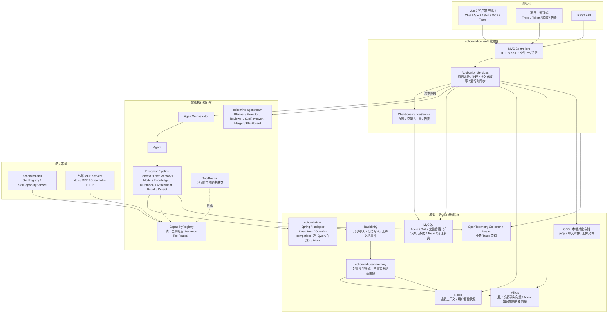
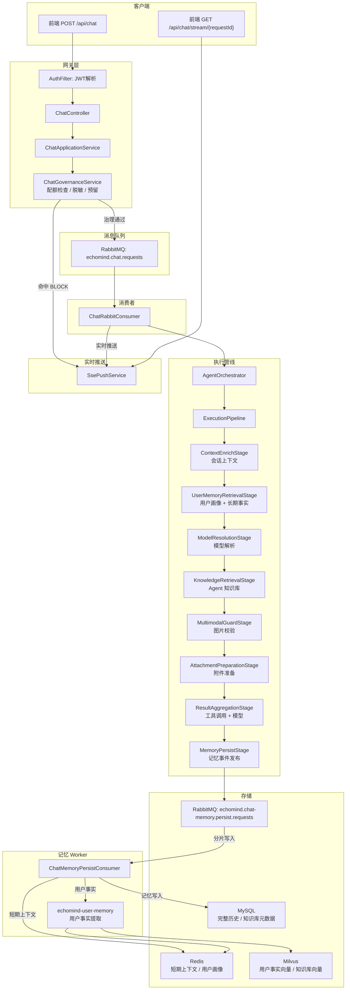
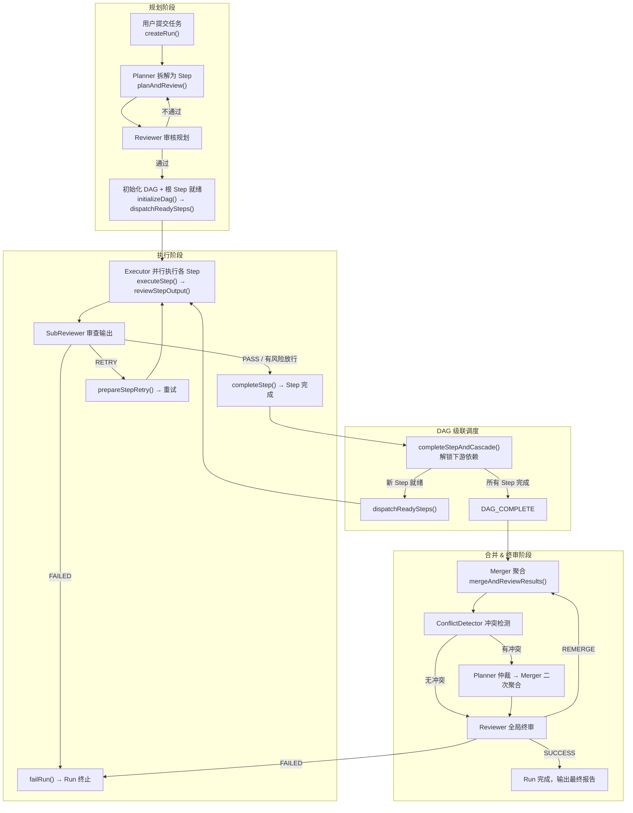

# EchoMind — AI Agent 平台

EchoMind 是一个 **企业级模块化 AI Agent 平台**，基于 Spring Boot 3.5 / Java 17 构建，提供完整的 Agent 生命周期管理、技能扩展体系和多 Agent 协作能力。

> 📺 [观看项目演示视频](./demo.mp4)

## 项目定位

EchoMind 旨在为企业提供一个可扩展、可定制的 AI Agent 基础设施，支持：

- **单 Agent 智能对话**：支持长上下文记忆、知识库检索、工具调用
- **多 Agent 协作**：基于 DAG 的团队任务编排，支持 Planner/Executor/Reviewer 角色分工
- **技能市场**：插件式 Skill JAR 上传，热更新无需重启
- **外部工具集成**：支持 MCP（Model Context Protocol）协议，无缝接入第三方工具服务

## 核心特性

| 特性 | 说明 |
| --- | --- |
| **模块化架构** | 清晰的模块边界，易于扩展和维护 |
| **多模型支持** | 支持 DeepSeek、OpenAI-compatible、阿里云百炼等多种模型 |
| **分层记忆系统** | Redis 短期上下文 + Milvus 长期事实向量 + MySQL 完整历史 |
| **治理能力** | 配额管理、敏感数据脱敏、告警监控一体化 |
| **事件驱动** | RabbitMQ 异步消息，解耦聊天和记忆写入 |
| **可观测性** | 内置 OpenTelemetry + Jaeger，支持业务 Trace 查询 |

## 技术栈概览

- **语言框架**：Java 17、Spring Boot 3.5、Spring AI 1.1.6
- **前端**：Vue 3、Pinia、Element Plus
- **数据库**：MySQL 8.3（业务数据）、Redis 7（缓存/锁）、Milvus 2.4（向量检索）
- **消息队列**：RabbitMQ 3.13
- **向量检索**：Spring AI Milvus VectorStore
- **模型协议**：OpenAI Chat Completions、DeepSeek Chat、Qwen/阿里云百炼（通过 OpenAI 兼容协议接入）
- **可观测性**：OpenTelemetry、Jaeger

## 整体架构图



## 模块说明

| 模块                      | 说明                                                                                                          |
| ----------------------- | ----------------------------------------------------------------------------------------------------------- |
| `echomind-common`       | 共享模型（AgentMessage）、异常体系、JSON Schema 校验                                                                      |
| `echomind-skill-api`    | Skill 接口规范 —— 零依赖纯 SPI                                                                                      |
| `echomind-llm`          | 动态模型路由，基于 Spring AI  接入 DeepSeek、OpenAI-compatible Provider（Qwen/阿里云百炼通过 OpenAI 兼容协议接入）和 Mock                                           |
| `echomind-memory`       | MySQL 完整会话历史供前端展示 + Redis 最近上下文以及用户画像供 LLM 读取 + Spring AI Milvus VectorStore 向量检索，普通聊天记忆按 `userId + sessionId` 隔离 |
| `echomind-user-memory`  | RabbitMQ 异步消费主 LLM 决策后的聊天事件，用轻量模型即时更新 Milvus 用户事实和 Redis 用户画像快照                                             |
| `echomind-mcp`          | MCP 工具 SPI 接口定义（ToolProvider / ToolSpec / ToolResult），运行时客户端和传输适配器在 echomind-agent 中实现                                             |
| `echomind-skill`        | Skill 注册中心、ClassLoader 隔离、市场管理                                                                              |
| `echomind-agent`        | Agent 执行管线、编排调度、Agent MySQL 持久化、统一能力注册、MCP 客户端运行时和工具适配                                                                      |
| `echomind-agent-team`   | 多 Agent 协作（Planner / Executor / Reviewer / SubReviewer / Merger）                                                                       |
| `echomind-console`      | REST API + 应用服务层 + 治理（配额/脱敏/告警/预算）                                                                 |
| `echomind-boot`         | Spring Boot 自动配置                                                                                            |
| `echomind-app`          | 应用启动入口                                                                                                      |
| `echomind-web`          | Vue 3 前端控制台（Pinia + Element Plus + Tailwind CSS）                                                       |
| `open-websearch`        | 外部 MCP 联网搜索与公开网页读取服务（基于第三方 Docker 镜像，Compose 默认使用 `duckduckgo` 并通过 `CapabilityRegistry` 暴露给 Agent）                    |

## 普通对话调用链路



## Agent Team 协作流程



## Agent Team 各阶段说明

### 执行流程

```
1. 规划阶段
   createRun() → publish RunStarted event → coordinator.onRunStarted()
     → publishControl(PLAN_AND_REVIEW) → TeamControlConsumer
     → coordinator.startRunPlan(runId)
       → blackboard.planAndReviewForCoordinator(runId)
         ├─ Planner 拆解任务为多个 Step (callPlanner)
         ├─ Reviewer 审核规划方案 (callReviewerForPlan)
         │    ├─ CONTINUE → 审核通过
         │    ├─ RETRY → Planner 重新规划（最多 maxPlanRetries 次）
         │    └─ FAILED → failRun()
         └─ markInitialStepStates → initializeDag() → 根 Step = READY
   → dispatchReadySteps() → tryClaimSlot() → publishExecuteStep

2. 执行阶段
   TeamStepExecutionConsumer 接收 ExecuteStepCommand
     → blackboard.executeStepPublic(runId, stepId)
       → selectExecutorWithModel → Agent 调用 → reviewStepOutput()
         ├─ SubReview PASS → completeStep(PASSED)
         ├─ SubReview ACCEPT_WITH_RISK → completeStep(FLAWED_ACCEPTED)
         ├─ SubReview RETRY → prepareStepRetry() → 重试（最多 maxStepRetries 次）
         └─ SubReview FAILED → failRun()
     → publishOutcome → StepCompleted / StepFailed → Run Events Queue

3. DAG 级联调度
   coordinator.onStepCompleted()
     → completeStepAndCascade(runId, stepId)
       ├─ 原子标记 Step 完成 + 递减下游依赖计数
       ├─ 返回新就绪的 Step 列表 → markStepsReadyFromCoordinator
       └─ dispatchReadySteps() → 为新就绪 Step 抢占并发槽位 + 派发
     → isDagComplete()?
       ├─ 否 → 继续等待后续 Step 完成
       └─ 是 → publishControl(DAG_COMPLETE) → 进入合并阶段

4. 合并 & 终审阶段
   coordinator.completeDag(runId)
     → blackboard.onDagCompleteInCoordinator(runId)
       → mergeAndReviewResults(run, team)
         ├─ callMerger → 聚合各 Step 结果
         ├─ detectConflicts → 冲突检测
         │    └─ 有冲突 → arbitrateConflicts → Planner 仲裁 → callMerger 二次聚合
         └─ reviewResults → GlobalReviewer 终审
              ├─ SUCCESS → completeRunWithFinalOutput → Run 完成
              ├─ REMERGE → Merger 重新聚合（最多 maxMergeAttempts 次）
              └─ FAILED → failRun()
       → destroyDag()  清理运行时 DAG 状态
```

Team Run、Step 和 Event 全部按当前登录用户隔离，前端 Team 看板只展示当前用户自己的 Team 和 Run 历史。系统内置定时巡检机制，会自动发现并修复因异常中断而处于非终态的 Run（重新规划、重新合并、或从数据库重建运行时状态并重新调度）。

### 审查阶段

| 阶段 | 审查者 | 允许的决策 | 重试上限 |
| --- | --- | --- | --- |
| **PlanReview** | REVIEWER | CONTINUE, RETRY, FAILED | `maxPlanRetries` |
| **SubReview**（每 Step） | SUB_REVIEWER | PASS, CONTINUE, REWORK, RETRY, ACCEPT_WITH_RISK, FAILED | `maxStepRetries` |
| **ConflictDetection** | REVIEWER（ConflictDetector Prompt） | hasConflict (boolean) | — |
| **Arbitration** | PLANNER | 仲裁建议（自由文本） | `maxArbitrations` |
| **GlobalReview** | REVIEWER | SUCCESS, CONTINUE, REMERGE, FAILED | `maxMergeAttempts` |

### SIMPLE 快速通道

当 `simpleFastPathEnabled` 开关启用且 Planner 判定 `taskLevel=SIMPLE` 且只产出一个可执行 Step 时，跳过 PlanReview、SubReview 和 GlobalReview，用规则能力匹配选择单个 Executor，执行完成后直接把 Executor 输出写为最终结果。

## Skill 开发指南

本节面向"平台用户自己开发一个 JAR，然后在前端 Skill 页面上传"的场景。用户不需要改 EchoMind 主项目代码，只要产物是一个符合 EchoMind SPI 的 JAR 即可。前端上传走 `POST /api/skills/upload`，后端会读取 JAR Manifest、实例化 Skill、写入 `echomind_skills`、保存 JAR 到 Skill marketplace / 对象存储，并立即注册到 `SkillRegistry` 和启用到 `CapabilityRegistry`。

### 1. 准备 `echomind-skill-api`

用户 Skill 只依赖 EchoMind 的 SPI 包：

```xml
<dependency>
    <groupId>com.echomind</groupId>
    <artifactId>echomind-skill-api</artifactId>
    <version>1.0.0-SNAPSHOT</version>
    <scope>provided</scope>
</dependency>
```

如果用户在本仓库外开发，先由平台方把 `echomind-skill-api` 发布到 Maven 仓库，或在本机安装一次：

```powershell
cd D:\claudeWorkSpace\ai-agent
mvn.cmd -q -pl echomind-skill-api install
```

### 2. 创建独立 Maven 项目

推荐使用 `maven-assembly-plugin` 打 `jar-with-dependencies`。

```xml
<project xmlns="http://maven.apache.org/POM/4.0.0"
         xmlns:xsi="http://www.w3.org/2001/XMLSchema-instance"
         xsi:schemaLocation="http://maven.apache.org/POM/4.0.0 https://maven.apache.org/xsd/maven-4.0.0.xsd">
    <modelVersion>4.0.0</modelVersion>

    <groupId>com.example</groupId>
    <artifactId>my-skill</artifactId>
    <version>1.0.0</version>

    <properties>
        <maven.compiler.source>17</maven.compiler.source>
        <maven.compiler.target>17</maven.compiler.target>
        <project.build.sourceEncoding>UTF-8</project.build.sourceEncoding>
    </properties>

    <dependencies>
        <dependency>
            <groupId>com.echomind</groupId>
            <artifactId>echomind-skill-api</artifactId>
            <version>1.0.0-SNAPSHOT</version>
            <scope>provided</scope>
        </dependency>
    </dependencies>

    <build>
        <plugins>
            <plugin>
                <groupId>org.apache.maven.plugins</groupId>
                <artifactId>maven-assembly-plugin</artifactId>
                <version>3.6.0</version>
                <configuration>
                    <archive>
                        <manifestEntries>
                            <EchoMind-Skill-Class>com.example.skill.MySkill</EchoMind-Skill-Class>
                            <EchoMind-Skill-Version>1.0.0</EchoMind-Skill-Version>
                        </manifestEntries>
                    </archive>
                    <descriptorRefs>
                        <descriptorRef>jar-with-dependencies</descriptorRef>
                    </descriptorRefs>
                </configuration>
                <executions>
                    <execution>
                        <id>make-assembly</id>
                        <phase>package</phase>
                        <goals>
                            <goal>single</goal>
                        </goals>
                    </execution>
                </executions>
            </plugin>
        </plugins>
    </build>
</project>
```

### 3. 实现 Skill 接口

```java
package com.example.skill;

import com.echomind.skill.api.Skill;
import com.echomind.skill.api.SkillMetadata;
import com.echomind.skill.api.SkillRequest;
import com.echomind.skill.api.SkillResult;

import java.util.List;
import java.util.Map;
import java.util.concurrent.CompletableFuture;

public class MySkill implements Skill {

    @Override
    public SkillMetadata metadata() {
        return new SkillMetadata(
            "my-skill",
            "1.0.0",
            "根据用户输入的 query 返回自定义处理结果。",
            Map.of(
                "type", "object",
                "properties", Map.of(
                    "query", Map.of(
                        "type", "string",
                        "description", "需要处理的用户输入内容"
                    )
                ),
                "required", List.of("query")
            ),
            List.of(),
            "用户名称",
            List.of("custom", "demo"),
            List.of("自定义处理", "my skill"),
            Map.of("query", List.of("内容", "输入", "问题"))
        );
    }

    @Override
    public CompletableFuture<SkillResult> execute(SkillRequest request) {
        return CompletableFuture.supplyAsync(() -> {
            String query = String.valueOf(request.parameters().getOrDefault("query", ""));
            if (query.isBlank()) {
                return SkillResult.failure("query 参数不能为空", 0);
            }
            return SkillResult.success("处理结果: " + query, 0);
        });
    }
}
```

### 4. 构建与上传

```powershell
cd path\to\my-skill
mvn.cmd clean package
```

上传产物：`target/my-skill-1.0.0-jar-with-dependencies.jar`

## 快速开始

### 环境要求

- Java 17+
- Maven 3.8+
- Node.js 18+ / npm（仅前端本地开发需要）
- Docker Desktop（推荐部署和 MySQL / Redis / RabbitMQ / Jaeger 本地依赖）
- 常用环境变量：`DEEPSEEK_API_KEY`、`DEEPSEEK_BASE_URL`、`ALIYUN_BAILIAN_API_KEY`、`Webhook`、OSS 相关 AccessKey

### 方式一：Docker Compose（推荐）

```bash
cd EchoMind
docker compose up -d
```

一键启动 MySQL + Redis + 后端 + 前端，访问 `http://localhost`。

### 方式二：本地运行

```powershell
# 构建
mvn.cmd -q -DskipTests compile

# 启动后端
mvn.cmd -f echomind-app/pom.xml spring-boot:run

# 启动前端（另一个命令窗口）
cd echomind-web
npm.cmd install
npm.cmd run dev
```

- 前端控制台：`http://localhost:5173`
- 后端 API：`http://localhost:8080`
