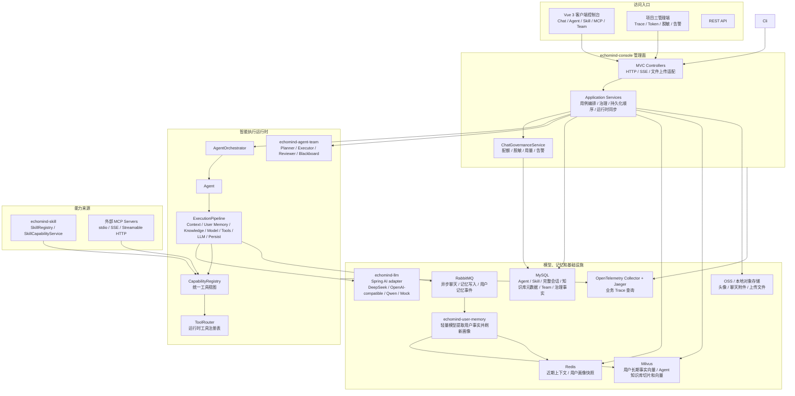
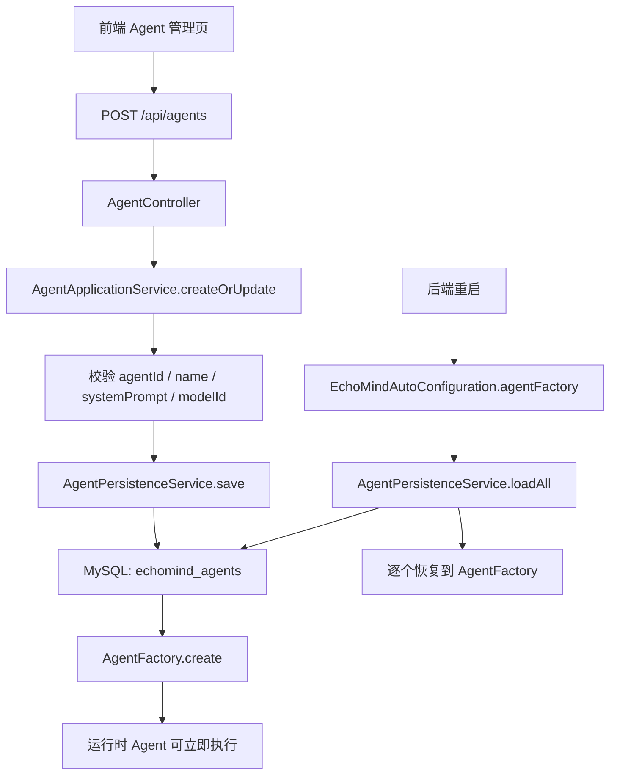
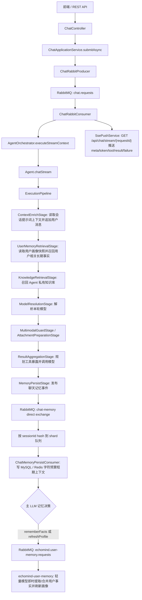
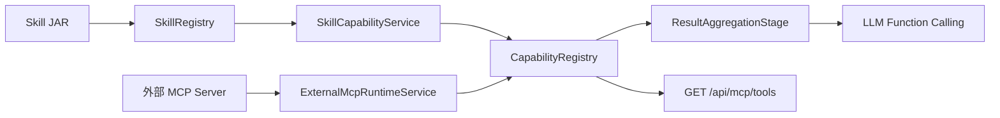
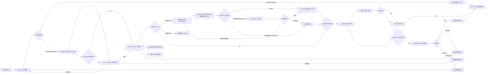

# EchoMind — AI Agent 平台

EchoMind 是一个模块化的 AI Agent 平台，基于 Spring Boot 3.5 / Java 17，支持 MCP 协议、插件式 Skill 市场和前端暗黑主题控制台。

当前 Docker Compose 默认部署业务依赖、前后端、OpenTelemetry Collector 和 Jaeger。后端已内置
OpenTelemetry Spring Boot Starter 和 EchoMind 业务 Span，本地默认导出新产生的聊天链路，项目三
管理端可直接查询 Trace、Token、脱敏和告警等后台能力；客户端 `http://localhost`
保持原有对话、Agent、Skill、MCP、Team 工作台。

## 技术架构

### 整体架构图



### 架构边界

EchoMind 现在按“管理面 MVC + 智能执行 Pipeline + 工具能力注册表”的方式组织：

| 层 | 代表类 | 责任 |
|---|---|---|
| HTTP 边界 | `AgentController`、`ChatController` | 接收请求、解析参数、返回 DTO，不直接拼业务流程 |
| 应用服务层 | `AgentApplicationService`、`ChatApplicationService` | 编排用例，负责校验、事务顺序、运行时同步；聊天请求归一化、队列流式消费和会话清理由同层 helper 承接 |
| 运行时层 | `AgentOrchestrator`、`ExecutionPipeline`、`CapabilityRegistry` | 执行 Agent、模型路由、工具注册和调用 |
| 持久化层 | `AgentMapper`、`SkillMapper`、`ChatMessageMapper` | 保存配置和完整会话消息，服务前端展示与审计 |

需要长期保留的数据必须进入持久化层。`AgentFactory`、`SkillRegistry`、`CapabilityRegistry`
只做运行时索引，不能作为事实来源；重启后会从 MySQL 或 Skill 目录重新恢复。

### 后端结构速读

后端不是纯 Clean Architecture，也不是把所有能力拆成微服务；当前形态是一个模块化单体：

```text
echomind-console
  Controller / Application Service / Admin Governance
        |
echomind-agent
  AgentOrchestrator -> Agent -> ExecutionPipeline
        |
        +-- ToolRouter -> ProviderRequestFactory
        +-- CapabilityRegistry -> SkillToolAdapter / MCPToolProviderAdapter
        +-- ModelResolutionStage -> DynamicModelRouter
        +-- ResultAggregationStage -> LLM Provider function calling
        +-- MemoryPersistStage -> RabbitMQ async persistence
        |
echomind-llm / echomind-memory / echomind-mcp / echomind-skill
  Provider / Store / External MCP Client / Skill Runtime
```

实践规则：

- Controller 只做 HTTP 适配，不拼 Agent 调用链路。
- Application Service 做用例编排，包括校验、持久化顺序、运行时索引同步和治理钩子。
- Runtime 模块只处理执行能力：Agent Pipeline、工具路由、模型调用、记忆读写。
- Provider 通过 Spring AI 适配 OpenAI-compatible 和 DeepSeek Chat Completions 协议，但仍只暴露 EchoMind 自己的 `ModelProvider` seam；它不认识 `12306`、`travel-planning` 这类具体业务工具名。
- Skill/MCP 工具通过 description、schema 和 metadata 自描述能力；普通聊天不再按 metadata 预筛选工具。

### 数据事实来源

| 数据 | 事实来源 | 运行时缓存/索引 |
|---|---|---|
| Agent 配置 | MySQL `echomind_agents` | `AgentFactory` |
| Skill 元数据和启停状态 | MySQL `echomind_skills` + Skill JAR | `SkillRegistry`、`CapabilityRegistry` |
| 当前对话记忆 | MySQL `echomind_chat_sessions` / `echomind_chat_messages`，按 `userId + sessionId` 保存完整历史，用于前端历史展示 | Redis `echomind:memory:recent:*` 按字符预算保存短期上下文，`short-term-window` 只做最大条数兜底 |
| 用户长期记忆 | Milvus `echomind_user_memory_spring_ai_v1` 按 `userId` 保存细粒度事实；Redis `echomind:user-profile:snapshot:*` 保存固定长度用户画像快照 | Spring AI VectorStore 负责 embedding 和中心向量召回；旧 collection 保留但不再读取 |
| 管理端账号 | MySQL `echomind_admin_users` | 管理端独立 JWT，不和客户端 `echomind_users` 混用 |
| AI 调用用量 | MySQL `echomind_ai_call_usage` | OpenTelemetry Span tag 和管理端 Token 仪表盘 |
| 用户 Token 配额 | MySQL `echomind_token_quotas` 配置限额，`echomind_token_quota_usage` 按用户日/月 bucket 原子结算真实已用 | Redis `echomind:quota:*` 保存当前 bucket 的 used 镜像和 in-flight reserved 冻结额度 |
| Provider Token 预算 | MySQL `echomind_provider_token_budgets` 配置平台级日/周/月限额，`echomind_provider_token_budget_usage` 按 Provider bucket 结算真实已用 | Redis `echomind:provider-budget:*` 保存当前 bucket 的 used 镜像和 in-flight reserved 冻结额度 |
| 敏感数据规则和事件 | MySQL `echomind_sensitive_rules` / `echomind_sensitive_events`，只保存脱敏后样本；请求侧 `BLOCK` 事件样本保存替代词结果 | `ChatApplicationService` 请求前和响应后治理钩子；请求侧 `BLOCK` 直接短路返回替代词，响应侧 `BLOCK` 仍抛阻断错误 |
| 告警规则和事件 | MySQL `echomind_alert_rules` / `echomind_alert_events` | 飞书自定义机器人 Webhook 推送、静默期和累计升级判断 |
| Agent 知识库 | MySQL 保存文档元数据和原文件引用；Milvus `echomind_agent_knowledge_spring_ai_v1` 保存切片正文和向量索引 | Spring AI VectorStore 做中心召回，命中后用小型 Milvus native adapter 扩展同文档前后窗口；旧 collection 保留但不再读取 |
| 工具可用性 | 已启用 Skill + 已挂载外部 MCP 服务 | `CapabilityRegistry` |

### Agent 创建与恢复链路



创建 Agent 时会先写 MySQL，再刷新运行时 `AgentFactory`。如果同一个 `agentId` 再次提交，
会覆盖数据库中的配置并刷新运行时 Agent。后端重启时，自动配置会先读取
`echomind_agents`，再补齐配置文件中声明但数据库没有的默认 Agent。启动期默认 Skill 补齐、
旧模型 ID 迁移和退役 Skill 清理由 `echomind.runtime` 声明，`AgentRuntimeBootstrapper`
只执行这些配置化规则，不再在启动流程里硬编码具体 Skill 或旧模型。

## 调用链路

### 聊天主链路



聊天接口会先从 `Authorization: Bearer ...` 解析当前用户；客户端 token 是 HS256 JWT，后端
`AuthFilter` 校验签名、过期时间和账号状态后写入 `AuthContext` ThreadLocal，并在请求结束清理。
无 token 的兼容请求归属 `default` 用户。公开聊天入口只保留异步请求：客户端调用 `POST /api/chat`
提交消息，拿到 `requestId` 后订阅 `GET /api/chat/stream/{requestId}` 接收 meta、token、tool 和终态事件。
入队前先完成用户级 Token 配额快速检查、Redis 原子预留、请求脱敏，并尽量根据请求模型或 Agent 默认模型解析
Provider 后做 Provider budget Redis 原子预留；请求侧命中 `BLOCK`
规则时不投递 RabbitMQ，而是注册 SSE owner 后直接缓存/推送成功 `result` 事件，响应内容为命中规则
replacement 按原文位置拼接后的文本。只有治理继续通过的 `ChatRequest` 会投递到 RabbitMQ。
`ChatRequest` 会携带用户侧和 Provider 侧 reservation ids；`ChatRabbitConsumer` 消费后不再重复请求配额校验，
只执行流式 Agent 管线，随后把 meta、token、工具进度、最终结果或失败直接交给 `SsePushService`
推送给前端。RabbitMQ 聊天请求死信重放也会在重新入队前按同一公式重建用户 quota 和 Provider budget 预留。
`SsePushService` 只通过 `GET /api/chat/stream/{requestId}` 转发事件，不直接执行模型调用。
这样前端仍有逐 token 体验，但模型执行由 `echomind.chat.requests` 队列削峰。
OpenAI 兼容 Provider（OpenAI、阿里云百炼/Qwen、Ollama、vLLM 等）和 DeepSeek Provider
都通过 Spring AI ChatModel adapter 调用 Chat Completions，并把 Spring AI 返回的文本、流式
片段、工具回调和原生 usage 转回 EchoMind 的 `ProviderResponse` / `ProviderStreamChunk`。
Mock Provider 仍只返回单段模拟结果。

### 管线阶段

| 顺序 | 阶段 | 责任 |
|---|---|---|
| 10 | `ContextEnrichStage` | 使用 `ctx.getMemoryKey()` 读取会话提示词上下文，把用户本轮消息加入上下文 |
| 12 | `UserMemoryRetrievalStage` | 按 `userId` 读取 Redis 用户画像快照，并用检索改写后的 query 从 Milvus 召回本轮相关长期事实 |
| 20 | `ModelResolutionStage` | 根据 Agent 默认模型或请求参数选择模型，写入 `modelId` 和 typed `resolvedModel` |
| 25 | `KnowledgeRetrievalStage` | 按 `agentId` 用同一个检索 query 从 Agent 私有知识库召回片段，并注入本轮上下文 |
| 30 | `MultimodalGuardStage` | 本轮携带图片时，校验模型必须具备 `VISION` 能力 |
| 35 | `AttachmentPreparationStage` | 把对象存储图片转换为模型可读的签名 URL 或 data URL |
| 40 | `ResultAggregationStage` | 复用已解析模型，委托 helper 构造 prompt、规划工具暴露和 `ProviderRequest`，再调用选中的 Provider |
| 50 | `MemoryPersistStage` | 把用户消息、工具结果与最终助手回复发布到聊天记忆异步写入队列 |

当前普通聊天记忆按登录用户和一次对话隔离：`PipelineContext.getMemoryKey()` 返回
`userId:sessionId`，MySQL 会话主表使用 `user_id + session_id` 复合主键；旧的无 token
请求和历史数据统一归属 `default` 用户。`agentId` 只表示本轮由哪个 Agent 执行，不会再让多个
会话共享同一份 Agent 记忆。第一阶段只隔离普通聊天会话和记忆，Agent、Skill、MCP 仍是全局资源；Team 定义和 Team Run 按当前用户隔离。

向量检索前会先尝试用轻量模型把用户原句改写成更适合 embedding 的检索 query；改写结果只存在
`PipelineContext.attributes`，只用于用户长期事实和 Agent 知识库的向量检索。用户原文仍进入最终
Prompt 和工具调用。改写失败、超时或返回无效 JSON 时回退原句。

普通聊天历史写入是异步的：`MemoryPersistStage` 只发布事件，后台
`ChatMemoryPersistConsumer` 再写 MySQL 完整历史和 Redis 短期上下文字数预算缓存。主 LLM 在同一次
模型调用末尾输出隐藏 JSON 决策：`rememberFacts` 控制是否异步提取用户事实，`refreshProfile` 控制
是否刷新用户画像；如果隐藏 JSON 解析失败，系统会降级为两个开关都开启，避免漏记。用户记忆 worker
收到事件后立即用轻量级 LLM 处理本轮对话，结合相近旧事实执行 add/update/delete，用户事实带
`firstObservedAt`、`lastObservedAt` 和 `updatedAt` 三个时间戳，普通聊天消息不再写入向量索引。
该队列按 `sessionId` hash 到多个分片队列，每个分片固定单消费者；高并发扩容应增加
`echomind.memory.persist-shards`，不要把单个分片改成多消费者，否则同一会话可能乱序。

RabbitMQ 当前只承接三类运行时消息：

- 异步聊天请求：`ChatRabbitProducer` 发布到 `echomind.chat.requests`，`ChatRabbitConsumer`
  消费后调用 `QueuedChatStreamExecutor` 执行流式 Agent，并把 SSE 事件直接交给
  `SsePushService` 按 `requestId` 推送。
- 普通聊天记忆事件：`RabbitChatMemoryPersistPublisher` 发布到
  `echomind.chat-memory.persist.exchange`，按 `shard.N` 路由到
  `echomind.chat-memory.persist.requests.shard.N`；`ChatMemoryPersistConsumer` 写 MySQL 完整历史和
  Redis 短期上下文。
- 用户长期记忆事件：`RabbitUserMemoryPersistPublisher` 发布 `echomind.user-memory.requests` 给
  `echomind-user-memory` worker。

`echomind.chat.requests`、聊天记忆分片队列和 `echomind.user-memory.requests` 都使用可靠发布和有限重试；
重试耗尽后进入 `echomind.dlx` 下的对应 DLQ。主后端会低并发消费这些 DLQ，把原始 payload、错误
headers、业务 key 和 traceId 落到 MySQL `echomind_rabbitmq_dead_letters`。聊天请求死信会释放入队前
冻结的用户 Token reservation，并向 SSE buffer 推送 `failure` 终态，避免前端长时间等待；聊天记忆和用户
记忆死信只归档，不自动重放，避免重复写历史或重复沉淀用户事实。运维可通过管理端接口按 dead-letter id
受控重放，重放成功后记录 `REPLAYED`。

Agent Team 目前仍是 `TaskExecutor` 推进 MySQL 黑板状态机，不使用 RabbitMQ。

### Skill、外部 MCP 与工具能力链路

Skill 由 `SkillDirectoryWatcher` 加载到 `SkillRegistry`，随后 `SkillCapabilityService`
会把已启用 Skill 同步到 `CapabilityRegistry`，供 Agent 对话时调用。

外部 MCP Server 由 `ExternalMcpRuntimeService` 管理：启动时会挂载配置文件里的
`echomind.mcp.external-servers`。前端 MCP 页面只展示服务端已配置的服务状态，并提供刷新
工具列表的观察入口；挂载配置由服务端配置文件或部署环境管理。REST 接口仍保留动态管理能力，
供服务端运维或自动化场景使用。底层协议客户端由 Spring AI MCP / Java MCP SDK 承接，当前支持 `stdio`、
`sse` 和 `streamable-http`；EchoMind 不直接使用 Spring AI MCP 的 `ToolCallbackProvider`，
而是先把远程工具适配回 `CapabilityRegistry`，模型函数调用可以像使用本地 Skill 一样使用这些外部工具。



工具调用采用“全量暴露，模型自主选择”的策略：`ToolRouter` 只维护已启用 Skill 和已挂载外部 MCP
工具的运行时索引；普通聊天每轮把全部可用工具转换为模型函数定义，模型再根据工具描述和参数 Schema
自主决定是否调用。Agent 的 `skillIds` 仍用于配置和前端展示，不再限制普通聊天可见工具。
平台不再做关键词、URL/domain 或站点名称筛选，也不按业务工具名硬编码选择逻辑；URL、站点范围和参数要求都应写进工具
`description` 与 `parameterSchema`，由模型 tool calling 和参数校验共同决定是否执行。
系统提示会要求模型在涉及当前事实、新闻、人物近况、政策、院校招生或自身不确定时主动调用 `open_web_search`，
在涉及今天、明天、后天、当前时间、星期和相对日期时优先调用 `date-query`，避免凭模型记忆猜测。
禁用 Skill 后，它会从能力注册表移除，旧对话也不能继续调用已禁用工具。
Provider 层不再按 `weather`、`12306` 等具体工具名猜参数或决定最终答案策略；Spring AI
负责模型 tool-calling 协议，EchoMind 的工具回调仍会按 `parameterSchema` 校验 JSON 参数。
工具调用结果统一回到 LLM 生成最终答复，不支持工具声明直出最终答案。

工具路由内部按职责拆分：

| Module | 责任 |
|---|---|
| `ToolRouter` | 工具注册、注销和全量工具列表 |
| `ProviderRequestFactory` | 把当前全部可用工具转换为模型函数定义 |

新 Skill JAR 仍可在 `SkillMetadata` 中填写 `keywords` 和 `aliases`，例如
`keywords=["发票审核","报销","invoice audit"]`、`aliases={"invoice":["发票","票据"]}`。
这些 metadata 主要用于市场展示、管理和后续能力分析；普通聊天是否调用工具由模型根据函数名、描述和 schema 判断。

MCP 的 REST 管理入口在 `/api/mcp` 下：`GET /api/mcp/servers` 查看已挂载服务，
`POST /api/mcp/servers/{id}/refresh` 重新读取工具列表。`POST /api/mcp/servers`、
`DELETE /api/mcp/servers/{id}`、`GET /api/mcp/tools` 和 `POST /api/mcp/tools/{name}/call`
作为服务端运维/自动化接口保留，默认前端工作台不再暴露动态挂载、卸载或工具直调。

### Agent Team 链路

团队任务从 `TeamController` 创建异步 Run，`TeamBlackboardService` 将 Team、Run、Step、Event 写入
MySQL 黑板。Team 定义和 Run 都按当前登录用户隔离，用户只能看到、执行和删除自己拥有的 Team；
旧无 token 请求仍归 `default` 用户。状态推进由 `TaskExecutor` 后台推进状态机。Planner 结构化拆解 Step，Reviewer 先审查计划，
Executor 按能力标签并发执行，Reviewer 再对照初始需求审查结果、触发 Step 重试、结果阶段 replan 或澄清，并生成最终报告。
每个角色最终仍通过 `AgentOrchestrator -> Agent -> ExecutionPipeline` 执行，但角色之间通过黑板交换上下文。

## 模块说明

| 模块 | 说明 |
|---|---|
| `echomind-common` | 共享模型（AgentMessage）、异常体系、JSON Schema 校验 |
| `echomind-skill-api` | Skill 接口规范 —— 零依赖纯 SPI |
| `echomind-llm` | 动态模型路由，基于 Spring AI adapter 接入 DeepSeek、OpenAI 兼容 Provider 和阿里云百炼 |
| `echomind-memory` | MySQL 完整会话历史供前端展示 + Redis 最近上下文供 LLM 读取 + Spring AI Milvus VectorStore 向量检索，普通聊天记忆按 `userId + sessionId` 隔离 |
| `echomind-user-memory` | RabbitMQ 异步消费主 LLM 决策后的聊天事件，用轻量模型即时更新 Milvus 用户事实和 Redis 用户画像快照 |
| `echomind-mcp` | 基于 Spring AI MCP 的外部 MCP 客户端、stdio/SSE/Streamable HTTP 传输和工具适配器 |
| `echomind-skill` | Skill 注册中心、ClassLoader 隔离、市场管理 |
| `echomind-agent` | Agent 执行管线、编排调度、Agent MySQL 持久化、统一能力注册 |
| `echomind-agent-team` | 多 Agent 协作（Planner / Executor / Reviewer） |
| `echomind-console` | REST API + 应用服务层 + Vue 3 前端 |
| `echomind-boot` | Spring Boot 自动配置 |
| `echomind-app` | 应用启动入口 |
| `open-websearch` | 外部 MCP 联网搜索与公开网页读取服务，Compose 默认使用 `duckduckgo` 并通过 `CapabilityRegistry` 暴露给 Agent |
| `skill-weather` | 天气查询 Skill（wttr.in） |
| `skill-calculator` | 数学表达式计算 Skill（exp4j） |
| `skill-markdown-code` | Markdown 代码块格式化 Skill |
| `skill-date-query` | 日期、时间、星期查询 Skill |
| `skill-github-intel` | GitHub 仓库、Release、Issue 和仓库搜索情报 Skill |
| `skill-railway-12306` | 12306 国内列车时刻、余票、票价、中转换乘和站点查询 Skill |
| `skill-travel-planning` | 多城市路线、预算、打包清单和签证时间表规划 Skill |

## 快速开始

### 环境要求
- Java 17+
- Maven 3.8+
- Node.js 18+ / npm（仅前端本地开发需要）
- Docker Desktop（推荐部署和 MySQL / Redis / RabbitMQ / Jaeger 本地依赖）
- 常用环境变量：`DEEPSEEK_API_KEY`、`DEEPSEEK_BASE_URL`、`ALIYUN_BAILIAN_API_KEY`、`Webhook`、OSS 相关 AccessKey

### 方式一：Docker Compose（推荐）

```bash
cd EchoMind
docker compose up -d
```

一键启动 MySQL + Redis + 后端 + 前端，访问 `http://localhost`。

服务清单：

| 服务 | 端口 | 说明 |
|------|------|------|
| mysql | 3306 | MySQL 8.3，数据持久化 |
| redis | 6379 | Redis，近期上下文缓存 + 用户画像快照 |
| rabbitmq | 5672 / 15672 | 异步聊天消息队列与管理台 |
| milvus | 19530 | 用户长期事实向量和 Agent 知识库切片/向量 |
| open-websearch | - | 外部 MCP 联网搜索和公开网页读取 |
| backend | 8080 | Spring Boot 后端 |
| user-memory | - | 用户长期事实和画像异步 worker |
| frontend | 80 | Vue 3 前端（Nginx） |
| admin-frontend | 8081 | 项目三管理端前端（Nginx） |

`open-websearch` 默认搜索引擎为 `duckduckgo`，优先保证本地 Compose 的稳定搜索体验；需要切换时可用
`OPEN_WEBSEARCH_DEFAULT_ENGINE` 覆盖。

如果 Docker 构建环境访问 Maven Central 不稳定，可以先用本机 Maven 打生产包，再使用运行镜像
Dockerfile 部署后端：

```powershell
powershell -NoProfile -ExecutionPolicy Bypass -File .\scripts\deploy-runtime.ps1
```

`Dockerfile.runtime` 只复制 `echomind-app/target` 和 `skills/*/target` 中的产物，不在容器内下载
Maven 依赖；常规 CI 或网络稳定环境仍可继续使用默认 `Dockerfile` 的多阶段构建。
Windows 上用 `scripts/deploy-runtime.ps1` 部署时会先执行 `scripts/load-compose-env.ps1`，
把用户/系统环境变量导入当前部署进程，避免 `Webhook` 等变量在 Docker Compose 展开时变成空值。
`docker/mysql/init.sql` 只会在 MySQL volume 首次创建时执行；已有 volume 升级必须先运行
`scripts/apply-mysql-migrations.ps1`。脚本按文件名顺序执行 `docker/mysql/migrations/*.sql`，
并用 MySQL 表 `echomind_schema_migrations` 记录已应用版本和校验和。

### 方式二：本地运行

```powershell
# 构建
mvn.cmd -q -DskipTests compile

# 启动后端
mvn.cmd -f echomind-app/pom.xml spring-boot:run

# 启动前端（另一个命令窗口）
cd echomind-web
npm.cmd install
npm.cmd run dev
```

- 前端控制台：`http://localhost:5173`
- 后端 API：`http://localhost:8080`
- H2 控制台（开发环境）：`http://localhost:8080/h2-console`

客户端和管理端登录态均为后端签发的 HS256 JWT access token。修改
`ECHOMIND_AUTH_TOKEN_SECRET` 或 `ECHOMIND_ADMIN_TOKEN_SECRET`，或从旧自定义 token 版本升级后，
浏览器里的旧 token 会失效，需要重新登录。

## API 参考

| 方法 | 端点 | 说明 |
|---|---|---|
| `POST` | `/api/auth/login` | 用户名密码登录，返回 token 和当前用户 |
| `POST` | `/api/auth/register` | 注册普通登录用户 |
| `POST` | `/api/auth/logout` | 登出占位接口，前端清理本地 token |
| `GET` | `/api/auth/me` | 查询当前认证用户；无 token 时返回 default 兼容用户 |
| `POST` | `/api/auth/avatar` | 上传当前用户头像，图片进入对象存储，大小不超过 2MB |
| `POST` | `/api/admin/auth/login` | 管理端账号登录，返回独立 admin token |
| `GET` | `/api/admin/auth/me` | 查询当前管理端用户 |
| `POST` | `/api/admin/auth/logout` | 管理端登出占位接口 |
| `GET` | `/api/admin/dashboard` | 查询管理端仪表盘真实汇总、模型分布、Token 趋势和最近调用 |
| `GET` | `/api/admin/usage/summary` | 查询所有客户端用户的总 Token 和调用次数 |
| `GET` | `/api/admin/usage/users` | 查询客户端用户列表及每个用户累计 Token |
| `GET` | `/api/admin/usage/users/{userId}/calls` | 查询指定客户端用户的调用明细、TraceID 和 Token 花费 |
| `GET` | `/api/admin/quotas` | 查询客户端用户 Token 配额和当前已结算使用比例 |
| `PUT` | `/api/admin/quotas/users/{userId}` | 更新客户端用户日/月 Token 限额和配额状态 |
| `GET` | `/api/admin/sensitive/rules` | 查询敏感数据脱敏/阻断规则 |
| `PUT` | `/api/admin/sensitive/rules` | 更新敏感数据规则 |
| `GET` | `/api/admin/sensitive/events` | 查询敏感数据命中事件，样本已脱敏 |
| `GET` | `/api/admin/alerts/rules` | 查询告警规则、阈值、静默期、升级策略和后端 `Webhook` 生效状态 |
| `PUT` | `/api/admin/alerts/rules` | 更新告警规则 |
| `GET` | `/api/admin/alerts/events` | 查询告警事件、升级状态、飞书推送状态和建议动作 |
| `GET` | `/api/admin/rabbitmq/dead-letters` | 查询 RabbitMQ DLQ 归档记录，支持按状态过滤 |
| `POST` | `/api/admin/rabbitmq/dead-letters/{id}/replay` | 按 dead-letter id 受控重放到原业务队列 |
| `GET` | `/api/admin/client-users` | 查询客户端用户列表、状态和数据规模 |
| `PUT` | `/api/admin/client-users/{userId}/status` | 管理端封禁或解封客户端账号 |
| `DELETE` | `/api/admin/client-users/{userId}` | 硬删除客户端账号及其聊天、用量、配额和记忆缓存 |
| `GET` | `/api/observability/traces` | 查询 Jaeger Trace，支持 `scope=business` 和 `userId` 过滤 |
| `GET` | `/api/observability/traces/{traceId}` | 查询单条 Trace 的完整 Span 树 |
| `POST` | `/api/chat` | 异步发送消息，返回 requestId 和 sessionId |
| `GET` | `/api/chat/stream/{requestId}` | 订阅异步最终结果 SSE |
| `GET` | `/api/chat/sessions` | 列出有记忆的会话摘要，预览跳过内部工具调用消息 |
| `GET` | `/api/chat/{sessionId}/history` | 查询会话展示历史，不返回内部工具调用消息 |
| `DELETE` | `/api/chat/{sessionId}` | 删除单条会话历史并回收关联附件 |
| `GET` | `/api/models` | 列出可用模型 |
| `PUT` | `/api/models/switch` | 切换默认模型 |
| `GET` | `/api/skills` | 列出所有 Skill |
| `POST` | `/api/skills/upload` | 上传 Skill JAR 包 |
| `POST` | `/api/skills/{id}/enable` | 启用 Skill |
| `POST` | `/api/skills/{id}/disable` | 禁用 Skill |
| `DELETE` | `/api/skills/{id}` | 删除 Skill |
| `GET` | `/api/agents` | 列出所有 Agent |
| `POST` | `/api/agents` | 创建或覆盖 Agent，并写入 MySQL |
| `GET` | `/api/mcp/servers` | 列出服务端配置或运行时挂载的外部 MCP 服务 |
| `POST` | `/api/mcp/servers/{id}/refresh` | 刷新外部 MCP 服务工具列表，前端工作台仅保留该操作 |
| `POST` | `/api/mcp/servers` | 动态挂载外部 stdio / SSE / Streamable HTTP MCP 服务，默认仅供服务端运维/自动化使用 |
| `DELETE` | `/api/mcp/servers/{id}` | 卸载外部 MCP 服务，默认仅供服务端运维/自动化使用 |
| `GET` | `/api/mcp/tools` | 列出外部 MCP 工具，默认前端不展示工具目录 |
| `POST` | `/api/mcp/tools/{name}/call` | 调用外部 MCP 工具，默认前端不提供直调入口 |
| `GET` | `/api/teams` | 列出 Agent 团队 |
| `POST` | `/api/teams` | 创建团队，Reviewer 必填 |
| `DELETE` | `/api/teams/{id}` | 硬删除团队及其 Run/Step/Event 黑板记录 |
| `POST` | `/api/teams/{id}/runs` | 创建异步团队 Run |
| `GET` | `/api/teams/{id}/runs` | 查询当前用户在团队下的 Run |
| `GET` | `/api/teams/{id}/runs/{runId}` | 查询 Run 黑板、Step 和事件 |
| `POST` | `/api/teams/{id}/runs/{runId}/resume` | 提交澄清信息并继续 Run |
| `GET` | `/api/team-runs` | 查询当前用户 Team Run 历史，与普通聊天历史分离 |

聊天、会话列表、历史查询和会话删除都以后端认证上下文中的用户为准；
前端或调用方不需要也不能提交可信 `userId`。默认登录账号可通过
`ECHOMIND_AUTH_DEFAULT_USERNAME` / `ECHOMIND_AUTH_DEFAULT_PASSWORD` 配置，未配置时为 `admin` / `admin123`。
用户头像 URI 保存到 MySQL `echomind_users.avatar_uri`，文件经 `ObjectStorageService` 写入 OSS 或本地兜底存储，
`/api/auth/me` 返回可展示的短期 URL。

项目三管理端账号单独使用 `echomind_admin_users` 和 `/api/admin/auth/*`，客户端账号继续使用
`echomind_users` 和 `/api/auth/*`；两类 token 不互认。管理端用量接口只统计客户端调用数据，
不会把管理端登录、刷新页面或查询 Trace 当作用户调用消费。

## Skill 开发指南

本节面向“平台用户自己开发一个 JAR，然后在前端 Skill 页面上传”的场景。用户不需要改
EchoMind 主项目代码，只要产物是一个符合 EchoMind SPI 的 JAR 即可。前端上传走
`POST /api/skills/upload`，后端会读取 JAR Manifest、实例化 Skill、写入 `echomind_skills`、
保存 JAR 到 Skill marketplace / 对象存储，并立即注册到 `SkillRegistry` 和启用到
`CapabilityRegistry`。

### 1. 准备 `echomind-skill-api`

用户 Skill 只依赖 EchoMind 的 SPI 包：

```xml
<dependency>
    <groupId>com.echomind</groupId>
    <artifactId>echomind-skill-api</artifactId>
    <version>1.0.0-SNAPSHOT</version>
    <scope>provided</scope>
</dependency>
```

如果用户在本仓库外开发，先由平台方把 `echomind-skill-api` 发布到 Maven 仓库，或在本机安装一次：

```powershell
cd D:\claudeWorkSpace\ai-agent
mvn.cmd -q -pl echomind-skill-api install
```

`echomind-skill-api` 必须使用 `provided` 作用域。平台运行时会提供这套 SPI，用户 JAR 里不要再打入
另一份 `com.echomind.skill.api.*`。

### 2. 创建独立 Maven 项目

用户可以在主项目外创建普通 Maven 工程，例如：

```text
my-skill/
  pom.xml
  src/main/java/com/example/skill/MySkill.java
```

推荐使用 `maven-assembly-plugin` 打 `jar-with-dependencies`。如果 Skill 用了第三方 SDK、HTTP
客户端、解析库等依赖，这些依赖必须进入最终 JAR；否则上传后运行时可能出现 `ClassNotFoundException`。

```xml
<project xmlns="http://maven.apache.org/POM/4.0.0"
         xmlns:xsi="http://www.w3.org/2001/XMLSchema-instance"
         xsi:schemaLocation="http://maven.apache.org/POM/4.0.0 https://maven.apache.org/xsd/maven-4.0.0.xsd">
    <modelVersion>4.0.0</modelVersion>

    <groupId>com.example</groupId>
    <artifactId>my-skill</artifactId>
    <version>1.0.0</version>

    <properties>
        <maven.compiler.source>17</maven.compiler.source>
        <maven.compiler.target>17</maven.compiler.target>
        <project.build.sourceEncoding>UTF-8</project.build.sourceEncoding>
    </properties>

    <dependencies>
        <dependency>
            <groupId>com.echomind</groupId>
            <artifactId>echomind-skill-api</artifactId>
            <version>1.0.0-SNAPSHOT</version>
            <scope>provided</scope>
        </dependency>
    </dependencies>

    <build>
        <plugins>
            <plugin>
                <groupId>org.apache.maven.plugins</groupId>
                <artifactId>maven-assembly-plugin</artifactId>
                <version>3.6.0</version>
                <configuration>
                    <archive>
                        <manifestEntries>
                            <EchoMind-Skill-Class>com.example.skill.MySkill</EchoMind-Skill-Class>
                            <EchoMind-Skill-Version>1.0.0</EchoMind-Skill-Version>
                        </manifestEntries>
                    </archive>
                    <descriptorRefs>
                        <descriptorRef>jar-with-dependencies</descriptorRef>
                    </descriptorRefs>
                </configuration>
                <executions>
                    <execution>
                        <id>make-assembly</id>
                        <phase>package</phase>
                        <goals>
                            <goal>single</goal>
                        </goals>
                    </execution>
                </executions>
            </plugin>
        </plugins>
    </build>
</project>
```

`EchoMind-Skill-Class` 是必填项，值必须是 Skill 实现类的全限定名。该类必须实现
`com.echomind.skill.api.Skill`，并提供无参构造器。

### 3. 实现 Skill 接口

```java
package com.example.skill;

import com.echomind.skill.api.Skill;
import com.echomind.skill.api.SkillMetadata;
import com.echomind.skill.api.SkillRequest;
import com.echomind.skill.api.SkillResult;

import java.util.List;
import java.util.Map;
import java.util.concurrent.CompletableFuture;

public class MySkill implements Skill {

    @Override
    public SkillMetadata metadata() {
        return new SkillMetadata(
            "my-skill",
            "1.0.0",
            "根据用户输入的 query 返回自定义处理结果。适合在用户明确要求执行 my-skill 自定义处理时调用。",
            Map.of(
                "type", "object",
                "properties", Map.of(
                    "query", Map.of(
                        "type", "string",
                        "description", "需要处理的用户输入内容"
                    )
                ),
                "required", List.of("query")
            ),
            List.of(),
            "用户名称",
            List.of("custom", "demo"),
            List.of("自定义处理", "my skill"),
            Map.of("query", List.of("内容", "输入", "问题"))
        );
    }

    @Override
    public CompletableFuture<SkillResult> execute(SkillRequest request) {
        return CompletableFuture.supplyAsync(() -> {
            long start = System.currentTimeMillis();
            try {
                String query = String.valueOf(request.parameters().getOrDefault("query", ""));
                if (query.isBlank()) {
                    return SkillResult.failure("query 参数不能为空", System.currentTimeMillis() - start);
                }

                String output = "处理结果: " + query;
                return SkillResult.success(output, System.currentTimeMillis() - start);
            } catch (Exception e) {
                return SkillResult.failure("my-skill 执行失败: " + e.getMessage(),
                    System.currentTimeMillis() - start);
            }
        });
    }
}
```

开发约束：

- `metadata().name() + "@" + metadata().version()` 是全局 Skill ID，例如 `my-skill@1.0.0`；同名同版本不能重复上传。
- `description` 和 `parameterSchema` 必须写清楚。普通聊天会把全部已启用 Skill 和外部 MCP 工具交给模型，
  模型主要依靠函数名、描述和 JSON Schema 判断是否调用。
- `keywords`、`aliases` 和 `tags` 主要用于市场展示、管理和后续能力分析，不再作为普通聊天的预筛选依据。
- 参数会按 `parameterSchema` 校验后传入 `SkillRequest.parameters()`，Skill 内仍应处理空值、非法业务值、超时和外部 API 错误。
- 执行失败时返回 `SkillResult.failure(...)`，不要让未捕获异常泄漏到运行时。
- 可按需实现 `onEnable()`、`onDisable()`、`onDestroy()` 生命周期钩子；这些钩子应保持幂等，避免长时间阻塞。

### 4. 构建可上传 JAR

```powershell
cd path\to\my-skill
mvn.cmd clean package
```

使用上面 assembly 配置后，上传这个产物：

```text
target/my-skill-1.0.0-jar-with-dependencies.jar
```

如果 Skill 没有任何第三方依赖，也可以上传普通 JAR；但推荐统一上传 `jar-with-dependencies`，
这样用户不需要关心运行时 classpath。

### 5. 通过前端上传并验证

在 EchoMind 前端进入 Skill 页面，点击“上传 Skill JAR”，选择构建出的 JAR。上传成功后，后端会立即完成：

```text
读取 MANIFEST.MF
  -> 找到 EchoMind-Skill-Class
  -> 用隔离 ClassLoader 加载并实例化 Skill
  -> 读取 metadata()
  -> 写入 MySQL echomind_skills
  -> 保存 JAR 到 echomind.skill.marketplace-dir / 对象存储
  -> 注册到 SkillRegistry
  -> 启用并同步到 CapabilityRegistry
```

也可以用接口验证：

```powershell
Invoke-RestMethod http://localhost:8080/api/skills
```

上传后的 Skill 默认是启用状态；如果在页面禁用，它会从 `CapabilityRegistry` 移除，普通聊天不会继续调用。
如果要更新同一个 Skill，建议把版本号从 `1.0.0` 提升到 `1.0.1` 后重新打包上传；或者先删除旧的
`my-skill@1.0.0`，再上传同名同版本 JAR。

## Agent Team 协作

EchoMind 支持多 Agent 角色协作。Team 定义、Run、Step 和 Event 按当前用户写入 MySQL，
作为用户私有团队黑板，不进入普通聊天会话历史。Team Run 由 `TaskExecutor` 后台异步推进，前端 Team 看板 0.25 秒轮询展示进度。

```
用户任务 → Planner（结构化拆解 Step）
              ↓
        Reviewer（规划后审查，可按 Run 跳过）
              ↓
        TeamControlCenter（DAG 依赖调度）
              ↓
        多 Executor（可并发的 Step 并发执行）
              ↓
        SubReviewer（高风险 Step 子评审，可按 Run 跳过）
              ↓
        MergeAgent（聚合对齐）→ ConflictDetector（冲突检测）→ PlannerArbitration（必要时仲裁）
              ↓
        GlobalReviewer（终审 / 重试 / 局部重规划 / 整体重规划 / 澄清 / 最终报告，可按 Run 跳过）
              ↓
        Run 看板 + 中文 DAG 流程图 + Markdown 下载
```

### 演示场景：活动策划

```
输入："为60人策划一场公司户外团建活动"

Planner 拆解 DAG：
  1. 搜索场地选项
  2. 查询天气预报
  3. 基于场地和天气估算预算
  4. 基于前置结果制定时间表

Agent 不是由硬编码规则直接指定。Planner 先输出 `requiredCapabilities`、`dependsOn` 和 `riskLevel`；
TeamControlCenter 把候选 Executor、能力标签、负载和健康度交给模型做自主选择，规则评分只作为兜底。
风险策略再决定是否进入 SubReviewer。
MergeAgent 聚合后会进入 ConflictDetector；若预算、日期、地点等口径冲突，Planner 先仲裁，MergeAgent 再二次聚合。

Executor 按能力标签分配并调用相关 Skill 处理每个子任务：
  - open_web_search → 场地选项
  - weather-query → 天气预报
  - calculator → 预算计算

Team Run 默认使用“质量优先”策略：PlanReview、SubReview 和 GlobalReview 全部开启，SIMPLE 任务不直返。
启动 Run 时可以改为平衡或最快策略，跳过部分 Review 来减少串行模型调用；开启 SIMPLE 直返后，
Planner 判定 `taskLevel=SIMPLE` 且只有一个可执行 Step 时，会用规则能力匹配选择单个 Executor，
执行完成后直接把 Executor 输出写为最终结果。

Reviewer 先审查 Planner 拆解是否覆盖初始需求，再对比所有 Executor 原始结果。
如果单个结果不合格，Reviewer 返回 `RETRY` 并点名重跑指定 Step；如果只需要重跑局部分支，
返回 `PARTIAL_REPLAN`；如果 Step 结构本身缺失或拆解方向错误，返回 `REPLAN` 重新规划，默认最多 1 次。
每次重试都会写入 Reflexion：失败原因、修改意见、上一轮输出摘要会进入 Step 黑板并带回 Executor。
如果需求有歧义，返回 `ASK_CLARIFICATION` 暂停 Run；通过后输出完整策划方案。
```

### 协作流程图



## 配置说明

默认 `application.yml`：

```yaml
echomind:
  auth:
    token-secret: ${ECHOMIND_AUTH_TOKEN_SECRET:echomind-dev-secret}
    token-ttl-seconds: ${ECHOMIND_AUTH_TOKEN_TTL_SECONDS:604800}
  admin:
    token-secret: ${ECHOMIND_ADMIN_TOKEN_SECRET:echomind-admin-dev-secret}
    token-ttl-seconds: ${ECHOMIND_ADMIN_TOKEN_TTL_SECONDS:604800}
  models:
    default-provider: aliyun-bailian
    providers:
      deepseek:
        api-key: ${DEEPSEEK_API_KEY}
        base-url: ${DEEPSEEK_BASE_URL:https://api.deepseek.com}
        models:
          - name: deepseek-v4-flash
            capabilities: [text, function]
            default: true
      aliyun-bailian:
        api-key: ${ALIYUN_BAILIAN_API_KEY}
        base-url: ${ALIYUN_BAILIAN_BASE_URL:https://dashscope.aliyuncs.com/compatible-mode/v1}
        models:
          - name: qwen3.7-max
            capabilities: [text, function]
            default: false
          - name: qwen3.6-plus
            capabilities: [text, function, vision]
            default: true
          - name: qwen3.6-flash
            capabilities: [text, function]
          - name: qwen3.5-omni-plus
            capabilities: [text, vision]
          - name: qwen-vl-plus
            capabilities: [text, vision]
          - name: qwen-vl-max
            capabilities: [text, vision]
  memory:
    short-term-window: 80       # Redis 短期上下文最大条数兜底
    short-term-max-chars: 12000 # Redis 单会话短期上下文总字数预算
    short-term-message-max-chars: 1500 # 单条消息进入 Redis 短期上下文前的最大字数
    redis-ttl-seconds: 604800   # Redis 近期缓存过期时间（7天）
    embedding-enabled: true
    embedding-base-url: https://dashscope.aliyuncs.com/compatible-mode
    embedding-model: text-embedding-v4
    embedding-dimension: 1024
    milvus-user-memory-collection: echomind_user_memory_spring_ai_v1
    milvus-knowledge-collection: echomind_agent_knowledge_spring_ai_v1
    persist-queue-name: echomind.chat-memory.persist.requests
    persist-exchange-name: echomind.chat-memory.persist.exchange
    persist-shards: 8           # 按 sessionId hash 分片，每个分片单消费者，避免同会话乱序
    async-persist-enabled: true
    summary-refresh-interval: 6
    retrieval-query-rewrite-model-id: aliyun-bailian:qwen3.6-plus # 检索 query rewrite 默认走 Qwen vision 模型
  user-memory:
    extractor-model-id: aliyun-bailian:qwen3.6-plus # 用户记忆提取默认走 Qwen vision 模型
    related-fact-top-k: 12       # 合并相近用户事实时召回的旧事实数量
    retrieval-min-similarity: 0.40 # 回答前注入用户事实的最低向量相似度
    merge-min-similarity: 0.65   # 合并旧事实候选的最低向量相似度
    profile-max-chars: 2000      # Redis 用户画像快照最大字符数
  skill:
    auto-load-path: ./skills/    # Skill JAR 自动加载目录
    hot-reload: true             # 热加载开关
    marketplace-dir: ./data/marketplace/
  mcp:
    external-servers:            # 启动时自动挂载的外部 MCP 服务
      - id: nowcoder-java-interview
        enabled: true
        transport: stdio
        command: [java, -jar, ./mcp/nowcoder-java-interview-mcp-server-1.0.0.jar]
        working-directory: ./mcp
      # 远程 MCP 示例：
      # - id: remote-docs
      #   enabled: true
      #   transport: streamable-http
      #   url: https://mcp.example.com
      #   endpoint: /mcp
      #   headers:
      #     Authorization: Bearer ${REMOTE_MCP_TOKEN:}
  runtime:
    agent-bootstrap:
      default-skill-merge-ids: [markdown-code, date-query, github-intel, 12306, travel-planning]
      model-migrations:
        - from-prefix: anthropic:claude-
          to-model-id: aliyun-bailian:qwen3.6-plus
        - from-prefix: openai:gpt-
          to-model-id: aliyun-bailian:qwen3.6-plus
        - from: deepseek:deepseek-chat
          to-model-id: aliyun-bailian:qwen3.6-plus
        - from: deepseek:deepseek-v4-flash
          to-model-id: aliyun-bailian:qwen3.6-plus
      knowledge-seeds:
        - agent-id: jvm-master
          file-name: jvm-master-private-knowledge.txt
          resource: classpath:/knowledge-seeds/jvm-master-private-knowledge.txt
          content-type: text/plain
        - agent-id: os-master
          file-name: os-master-private-knowledge.txt
          resource: classpath:/knowledge-seeds/os-master-private-knowledge.txt
          content-type: text/plain
        - agent-id: zhangxuefeng
          file-name: zhangxuefeng-volunteer-knowledge.txt
          resource: classpath:/knowledge-seeds/zhangxuefeng-volunteer-knowledge.txt
          content-type: text/plain
    retired-skills:
      skill-ids: [qq-mail, web-search, zhangxuefeng-perspective, geng-academic-fraud-detector]
```

启动迁移、默认 Skill 合并、Agent 私有知识库 seed 和退役 Skill 清理都以配置文件为准；Java 属性类只保留空规则和最小兜底 Agent，
避免新增或退役 Skill / 默认 Agent 时还要改主项目代码。默认聊天模型现在使用阿里云百炼 `aliyun-bailian:qwen3.6-plus`，
该模型在项目配置中同时具备 `text`、`function` 和 `vision` 能力。较长系统提示词可通过
`system-prompt-resource` 从 classpath 资源加载，例如张雪峰 Agent 使用 GitHub `zhangxuefeng-skill`
的 `SKILL.md` 内容作为系统提示词资源。

## 测试与部署

常用验证命令：

```bash
# 本地编译
mvn -q -DskipTests compile

# 全量测试。如果本机 Maven 镜像异常，可使用 Docker Maven 避免本地 settings.xml 干扰。
mvn -q test
docker run --rm -v "D:\claudeWorkSpace\ai-agent:/workspace" -w /workspace \
  maven:3.9-eclipse-temurin-17 mvn -q test

# 重建并部署前后端
mvn -q clean package -Dmaven.test.skip=true
docker build -f Dockerfile.runtime -t ai-agent-backend:latest .
docker build -f echomind-web/Dockerfile.runtime -t ai-agent-frontend:latest echomind-web
docker build -f echomind-web/Dockerfile.admin-runtime -t ai-agent-admin-frontend:latest echomind-web
powershell -NoProfile -ExecutionPolicy Bypass -File scripts/apply-mysql-migrations.ps1 -StartDatabase
docker compose up -d --remove-orphans backend frontend admin-frontend otel-collector jaeger

# 验证服务和 Agent 持久化
curl http://localhost:8080/actuator/health
curl http://localhost/api/agents
docker exec echomind-db mysql --default-character-set=utf8mb4 \
  -uechomind -pechomind_secret echomind \
  -e "select agent_id,name,model_id,skill_ids_json from echomind_agents;"
```

说明：

- 默认部署启动 OpenTelemetry Collector 和 Jaeger，管理端 Trace 页面可直接查询新产生的聊天链路。
- 后端内置 OpenTelemetry Spring Boot Starter 和业务手动 Span；本地默认 `OTEL_TRACES_EXPORTER=otlp`，`OTEL_EXPORTER_OTLP_ENDPOINT=http://otel-collector:4318`。
- Collector 同时把 Trace 原始 OTLP JSON 写入宿主机 `data/otel-traces/traces.json`，并按 64MB / 7 天 / 20 个备份轮转；这是临时留档，不作为管理端实时查询后端。
- 后端只等待 Collector 容器启动，不依赖观测组件健康状态；如需关闭导出，设置 `OTEL_TRACES_EXPORTER=none`。
- 业务 Span 覆盖聊天提交/消费、Agent 编排、Pipeline Stage、模型调用和 Skill/MCP 工具调用；一次真实聊天在 Jaeger 中应能看到多 Span 链路，而不是只有单个 HTTP Span。
- 聊天业务 Span 会写入 `echomind.user_id`、`echomind.account_type=client`、模型名、延迟和 token tag；管理端 Trace 查询支持按 `userId` 转成 Jaeger tag 过滤。
- 每次普通聊天和 Team 内部 LLM 调用都会按客户端用户落库到 `echomind_ai_call_usage`，管理端可查看所有用户总 Token、单用户总 Token、单次调用 Token、今日请求、今日 Token、平均响应、模型分布和 Token 趋势。Team 调用复用同一套用户日/月配额，不新增 Team 配额表；`operation` 使用 `echomind.team.planner/reviewer/executor/sub_reviewer/merge/conflict_detector/arbitration/repair` 区分协作阶段。Token 只接受模型服务原生 usage，字段 `usage_source=PROVIDER`；模型未返回原生 usage 时拒绝记录用量，避免展示预估数据。用户 quota 和 Provider budget 都先在 Redis 中按固定预留值冻结 in-flight 额度，真实 provider usage 返回后再分别写入 `echomind_token_quota_usage` 和 `echomind_provider_token_budget_usage` 的日/月或日/周/月 bucket；MySQL 只保存真实已用，Redis 保存 used 热镜像和 reserved 冻结额度。后置结算不拒绝已完成调用，如本次用量使 bucket 超限，下一次请求前预留会返回配额或预算错误。
- 项目三管理端是 Agent 项目的后台治理面，不新增独立 AI 网关或 OpenAI `/v1` 入口；脱敏和告警通过 `/api/chat/*` 现有链路的治理钩子实现。请求侧命中 `BLOCK` 会阻止进入 Agent/RabbitMQ 管线并返回替代词拼接结果，响应侧命中 `BLOCK` 仍返回阻断错误；敏感事件只保存脱敏后样本或替代词结果，告警统一读取后端运行环境变量 `Webhook` 推送到飞书自定义机器人，不在前端配置规则级 Webhook；静默期内同类告警累计到阈值后会发送一条升级告警。
- 管理端 Trace 页面运行在独立端口 `8081`，不直连 Jaeger；默认通过后端代理 `http://jaeger:16686` 查询真实 Span。后端会从 Jaeger span tags 提取用户、Agent、会话、模型和 prompt/completion/total token，页面在 Trace 详情和 Span 行直接展示这些字段，同时保留原始 tags/logs 供排障。
- Trace 只能查询导出开启后新产生的链路；导出关闭期间产生的旧 TraceID 不会补写到 Jaeger，`data/otel-traces` 中的文件只用于排障留档和手工检索。
- Trace 列表默认只展示 `scope=business` 的 `echomind.chat.*` 对话链路，避免管理端查询请求本身刷出大量单 Span；
  需要查看全部 HTTP/JDBC/Redis Span 时可切换到 `scope=all`。
- 兼容旧命令：`docker-compose.observability.yml` 仍可传入，但实际观测服务已在默认 compose 中。

开发时建议按下面顺序检查：

```powershell
cd D:\claudeWorkSpace\ai-agent
mvn.cmd -q -DskipTests compile
mvn.cmd -q -pl echomind-agent,echomind-llm,echomind-boot -am "-Dtest=ToolRouterTest,OpenAICompatibleProviderTest,DeepSeekProviderTest,ResultAggregationStageProviderRequestTest,AgentRuntimeBootstrapperTest" "-Dsurefire.failIfNoSpecifiedTests=false" test
cd .\echomind-web
npm.cmd run build
```

改动数据库表或部署脚本时，再额外执行：

```powershell
cd D:\claudeWorkSpace\ai-agent
powershell -NoProfile -ExecutionPolicy Bypass -File .\scripts\apply-mysql-migrations.ps1 -StartDatabase
powershell -NoProfile -ExecutionPolicy Bypass -File .\scripts\deploy-runtime.ps1
```

```powershell
docker compose -f docker-compose.yml -f docker-compose.observability.yml --profile observability up -d --remove-orphans backend frontend admin-frontend otel-collector jaeger
```

当前已覆盖的关键测试：

| 测试类 | 覆盖点 |
|---|---|
| `AgentPersistenceServiceTest` | Agent 配置和 MySQL 实体之间的序列化/反序列化 |
| `AgentApplicationServiceTest` | 创建 Agent 时先持久化，再注册运行时索引；空 Skill 列表规范化；非法配置拦截 |
| `ToolRouterTest` | 工具注册表的注册、列出和按来源注销 |
| `OpenAICompatibleProviderTest` / `DeepSeekProviderTest` | Spring AI adapter 的 Prompt/options 映射、工具回调、原生 usage 和工具不直出约束 |
| `AgentRuntimeBootstrapperTest` / `RetiredSkillMigrationTest` | 启动恢复、配置化默认 Skill 补齐、旧模型迁移、fallback Agent 和退役 Skill 清理 |
| `AgentKnowledgeApplicationServiceTest` | Agent 知识库上传校验和 Memory 模块调用参数整理 |

## 依赖方向

```
echomind-skill-api  ←  （零依赖，纯 SPI）
echomind-common     ←  （零依赖）
echomind-llm        ←  common + protocol adapters
echomind-memory     ←  common
echomind-mcp        ←  common
echomind-skill      ←  skill-api, common, memory
echomind-agent      ←  skill-api, common, llm, memory, mcp, skill
echomind-agent-team ←  agent, skill-api
echomind-console    ←  agent, agent-team(可选), skill, mcp
echomind-boot       ←  console, agent, skill, llm, memory, mcp
echomind-app        ←  boot
skills/*            ←  skill-api（provided 作用域，隔离 ClassLoader）
```

## 技术栈

- **Java 17** — Records、Virtual Thread 就绪
- **Spring Boot 3.5.14**
- **Spring AI 1.1.6**
- **Vue 3 + Element Plus** — 前端控制台
- **MySQL 8.3** — 生产数据库（Docker Compose）
- **Redis** — 近期上下文缓存与用户画像快照
- **Milvus** — 用户长期事实向量和 Agent 知识库切片/向量检索
- **H2** — 本地开发数据库
- **Maven 3.8.6** — 多模块构建
- **MCP 协议 2024-11-05** — 外部工具集成

## 开源协议

本项目仅用于学习和演示目的。
