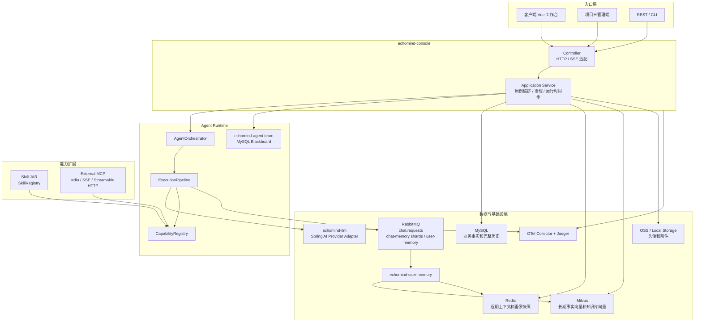

# EchoMind Harness

这份 harness 是给开发者和 AI Agent 读项目、改项目、复盘项目用的入口文档。它不替代根目录的 `AGENTS.md`、`README.md` 和 `CLAUDE.md`，而是把“读代码路径、硬约束、标准命令、当前状态”集中放在 `docs/harness` 下，方便后续按固定方式接手。

## 项目概览

EchoMind 是一个 Java 17 / Spring Boot 3.5 + Vue 3 的 AI Agent 平台。核心能力包括：

- 多模型接入：`echomind-llm` 通过 Spring AI adapter 接入 DeepSeek、OpenAI 兼容接口、阿里云百炼等 Chat Completions 模型。
- Agent 管理：Agent 配置落 MySQL，运行时恢复到 `AgentFactory`。
- 对话执行：公开聊天只保留异步入口 `POST /api/chat` 入队，`GET /api/chat/stream/{requestId}` 订阅消费端直推的 SSE meta/token/tool/result/failure 事件。
- RabbitMQ 用途：只承接 `echomind.chat.requests` 异步聊天请求、`echomind.chat-memory.persist.exchange` 普通聊天记忆分片写入，以及 `echomind.user-memory.requests` 用户长期记忆事件；Agent Team 当前不走 RabbitMQ。
- 链路追踪：后端内置 OpenTelemetry Spring Boot Starter 和 EchoMind 业务 Span；本地 Compose 默认启动 OpenTelemetry Collector 和 Jaeger，管理端 Trace 页面查询新产生的链路。
- 记忆系统：MySQL 按 `userId + sessionId` 保存普通聊天完整会话；Redis 按字符预算保存单会话短期上下文和用户画像快照；Milvus 保存用户长期事实向量以及 Agent 知识库切片正文和向量。
- Skill 系统：本地 JAR 插件通过 `SkillRegistry` 加载，启用后同步到 `CapabilityRegistry`。
- 工具路由：`ToolRouter` 是入口，`ToolMatchScorer` 只基于工具显式 `keywords`、`aliases`、`tags` 和工具名做预匹配；参数由模型正式 tool call 生成并按 schema 校验。
- 外部 MCP：主项目只作为 MCP 客户端接入外部 MCP Server，不再把主项目暴露成 MCP Server；底层连接使用 Spring AI MCP / Java MCP SDK，支持 stdio、SSE 和 Streamable HTTP。
- Agent Team：已演进为 MySQL 黑板驱动的异步 DAG 协作，Planner / Reviewer / TeamControlCenter / AgentSelector / Executor / SubReviewer / MergeAgent / ConflictDetector / GlobalReviewer 通过 Run / Step / Event 交换上下文。

## 整体架构图



## 真实目录对应

```text
项目根目录
├── AGENTS.md                 # 全局协作规则
├── CLAUDE.md                 # Claude / AI 工具上下文
├── README.md                 # 面向用户和开发者的主说明
├── docs/harness/             # 本 harness
├── echomind-common/          # 公共模型、异常、Schema 校验
├── echomind-skill-api/       # Skill SPI，插件 JAR 的最小依赖
├── echomind-skill/           # Skill 加载、市场状态、热加载
├── echomind-llm/             # 模型 Provider、Spring AI adapter、模型路由
├── echomind-memory/          # 会话记忆、Milvus 向量检索、知识库、用户画像快照端口
├── echomind-mcp/             # MCP 工具 provider 抽象，外部 MCP 运行时适配在 echomind-agent/tool/mcp
├── echomind-agent/           # 单 Agent 执行、Pipeline、工具路由、能力注册表
├── echomind-agent-team/      # 多 Agent 协作编排
├── echomind-console/         # REST API、Application Service、CLI
├── echomind-boot/            # Spring Boot 自动装配
├── echomind-app/             # 应用启动入口和 application.yml
├── echomind-web/             # Vue 前端
└── skills/                   # 内置 Skill 示例
```

## 从哪里开始读

第一次读项目，按这个顺序走：

1. 读根目录 `README.md`，先理解整体调用链路。
2. 读根目录 `AGENTS.md`，了解这个项目最重要的硬约束。
3. 读 `docs/harness/src/api/ARCHITECTURE.md`，看接口层和应用服务层怎么分工。
4. 读 `docs/harness/src/db/CONSTRAINTS.md`，确认哪些数据必须持久化，哪些只是缓存。
5. 后端从 `echomind-console` 的 Controller 进入，再顺着 Application Service 往下读。
6. 对话主链路从 `ChatController`、`ChatApplicationService`、`ChatRabbitConsumer`、`AgentOrchestrator`、`ExecutionPipeline` 读。
7. 工具调用从 `CapabilityRegistry`、`SkillCapabilityService`、`ExternalMcpRuntimeService` 读。
   如果在看工具选择问题，继续读 `ToolRouter`、`ToolMatchScorer`、`ToolExposurePlanner`
   和 `ProviderRequestFactory`。
8. 前端从 `echomind-web/src/stores` 和页面组件读，先看状态如何跨路由保持。

## 硬约束

- MySQL 是 Agent、Skill 状态、前端完整会话历史、知识库文档元数据的事实来源。
- Redis 是 LLM 最近上下文和用户画像快照来源；Milvus 是用户长期事实以及知识库切片正文和向量事实来源；Redis 用户画像快照是事实层的压缩结果；LLM 不从 MySQL 读取聊天历史。
- `AgentFactory`、`SkillRegistry`、`CapabilityRegistry` 都是运行时索引，不允许当持久化存储。
- Controller 不写业务流程，只做 HTTP 适配和 DTO 转换。
- Application Service 负责用例编排、校验、持久化顺序和运行时同步。
- 单 Agent 执行逻辑放 `echomind-agent`，团队协作逻辑放 `echomind-agent-team`。
- 主项目只接入外部 MCP Server，不恢复“主项目暴露 MCP Server”的旧能力。
- 禁用 Skill 或卸载 MCP 后，必须同步移除 `CapabilityRegistry` 中的工具。
- Provider 不允许按具体 Skill 名称硬编码默认参数、工具选择或最终答案策略；新增工具应通过
  `description`、`parameterSchema`、`keywords`、`aliases` 等 metadata 自描述。
- 面向中文用户的 Skill 必须在 `keywords` 或 `aliases` 中提供中文触发词；工具路由只做中文文本归一化，
  不把英文 `tags` 自动翻译成中文，也不在平台层补业务词表。
- 普通聊天记忆按 `userId + sessionId` 隔离；旧无 token 请求归 `default` 用户，不要改回“每个 Agent 一份记忆”。
- 第一阶段只隔离普通聊天会话和记忆；Agent、Skill、MCP 仍是全局资源。Team 定义和 Team Run 按当前用户隔离。
- Trace 埋点使用 OpenTelemetry API，不自建替代标准 Span 的追踪模型。
- 前端页面跳转不能导致聊天会话状态丢失，应由 Pinia store 承接跨路由状态。
- 修改架构、接口、调用链路后，同步更新根目录 `README.md`、`CLAUDE.md` 或本 harness。

## 标准操作

优先使用本目录下的 `Makefile` 作为命令入口：

```powershell
cd D:\claudeWorkSpace\ai-agent\docs\harness
make check
make test
make migrate
make deploy
```

如果本机没有 `make`，可以打开 `docs/harness/Makefile`，直接复制里面对应目标的 PowerShell 命令执行。
`make migrate` 会启动 Docker Compose 里的 MySQL，并按顺序执行 `docker/mysql/migrations/*.sql`；
`make deploy` 会在后端重启前自动执行同一迁移入口，避免旧 MySQL volume 缺表导致生产 profile
启动失败。

## 读改原则

- 先找入口，再找用例编排，再找运行时实现，最后看持久化。
- 发现重复代码时，先判断是不是模块边界不清导致的，不要直接抽公共工具类。
- 发现内存 Map 保存业务数据时，优先判断是否应该落 MySQL。
- 发现 Controller 里业务逻辑变厚时，优先下沉到 Application Service。
- 发现 Agent、Skill、MCP 互相直接调用时，优先改为通过 `CapabilityRegistry` 或编排层解耦。
- 发现工具路由继续长硬编码时，优先让工具 metadata 自描述，不要把具体业务工具名写进 Provider 或主项目路由层。
