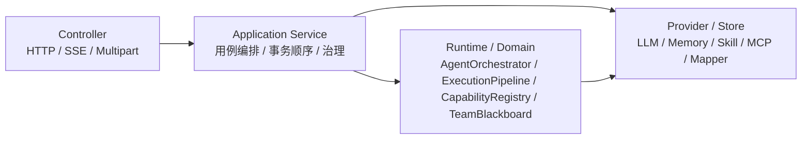

# API 层架构决策

本文档描述 EchoMind API 层的职责边界、调用链路和新增接口时必须遵守的规则。真实代码主要位于：

- `echomind-console/src/main/java/com/echomind/console/controller/rest`
- `echomind-console/src/main/java/com/echomind/console/service`
- `echomind-console/src/main/java/com/echomind/console/dto`

## 分层边界

```text
Controller
  -> Application Service
  -> Runtime / Domain Service
  -> Mapper / Store / Provider
```



Controller 只负责 HTTP 适配：

- 接收路径参数、查询参数、请求体和文件上传。
- 做轻量格式校验。
- 调用一个明确的 Application Service 方法。
- 返回 DTO、SSE 或文件上传结果。

Controller 不应该：

- 直接拼 Agent 执行链路。
- 直接操作 Mapper。
- 直接改运行时注册表。
- 直接调用 LLM Provider、Skill 或 MCP Client。

Application Service 负责用例编排：

- 参数语义校验。
- 事务顺序。
- 持久化和运行时同步。
- 把底层异常转换成前端能理解的业务错误。

Runtime / Domain Service 负责真正的执行能力：

- `AgentOrchestrator`
- `ExecutionPipeline`
- `CapabilityRegistry`
- `SkillCapabilityService`
- `ExternalMcpRuntimeService`
- `MemoryManager`
- `AgentKnowledgeService`

## 当前 Controller 入口

| Controller | 责任 |
|---|---|
| `AuthController` | 登录、注册、登出占位、当前用户查询和用户头像上传 |
| `AdminAuthController` | 管理端登录、当前管理端用户查询；使用独立管理端账号体系 |
| `AdminDashboardController` | 管理端真实仪表盘数据，聚合请求量、Token、响应耗时、模型分布和趋势 |
| `AdminClientUserController` | 管理端查询客户端用户，封禁、解封和硬删除客户端用户数据 |
| `AdminSensitiveController` | 管理端配置敏感数据脱敏/阻断规则，并查询脱敏事件 |
| `AdminAlertController` | 管理端配置告警规则、静默期和升级策略，展示后端 `Webhook` 生效状态，并查询告警事件 |
| `AdminRabbitDeadLetterController` | 管理端查询 RabbitMQ DLQ 归档记录，并按 dead-letter id 受控重放 |
| `AdminUsageController` | 管理端 Token 用量总览、客户端用户列表和单用户调用明细 |
| `AgentController` | Agent 创建、更新、删除和知识库管理入口 |
| `ChatController` | 异步聊天提交、异步结果 SSE、会话列表、历史和删除 |
| `SkillController` | Skill 列表、上传、启停、删除 |
| `MCPController` | 外部 MCP Server 挂载、卸载、刷新和工具直调 |
| `ModelController` | 模型列表、默认模型切换 |
| `ObservabilityController` | Trace 配置、Jaeger Trace 搜索和按 TraceID 查询 Span |
| `StorageController` | 对象上传，当前支持本地和阿里云 OSS |
| `TeamController` | Agent Team 创建、执行和协作状态查询 |

## 当前 Application Service

| Service | 责任 |
|---|---|
| `AuthApplicationService` | 用户登录、注册、默认用户初始化、token 签发和头像对象存储写入 |
| `AdminAuthApplicationService` | 管理端默认账号初始化、登录校验和 admin token 签发 |
| `AdminDashboardService` | 从真实用量表和客户端用户表聚合管理端仪表盘，不生成成本、余额等项目没有的数据 |
| `ClientUserAdminService` | 管理端客户端用户列表、账号状态更新和用户数据硬删除编排 |
| `AgentApplicationService` | Agent 配置校验、MySQL 持久化、运行时 AgentFactory 同步 |
| `AgentKnowledgeApplicationService` | Agent 知识库 HTTP 上传校验、原文件对象存储写入、下载、删除清理和 Memory 模块调用 |
| `ChatApplicationService` | 保留异步提交、队列流式消费和会话删除的用例入口；请求归一化、队列流式消费和会话附件清理由同包 helper 承接 |
| `ChatGovernanceService` | 收口聊天请求/响应治理：Token 配额快速检查和预留、敏感数据、调用用量和调用错误告警 |
| `AiCallUsageService` | 记录每次客户端 AI 调用的 TraceID、用户、模型、延迟、状态和 token，并用真实 provider usage 触发用户 quota 与 Provider budget 后置结算 |
| `SensitiveDataService` | 在聊天请求进入 Agent 前、响应返回前做敏感数据脱敏/阻断；请求侧 `BLOCK` 返回替代词短路结果，响应侧 `BLOCK` 仍抛阻断异常，并记录脱敏后事件 |
| `AlertService` | 根据调用错误、错误率、Provider Token 预算和敏感数据事件生成告警，按静默期推送飞书自定义机器人 Webhook，并在静默累计达阈值时发送升级告警 |
| `RabbitDeadLetterService` | 归档 RabbitMQ DLQ 原始消息、执行聊天请求死信补偿，并提供手动重放能力 |
| `UsageQueryService` | 管理端查询所有用户总 token、单用户总 token 和单次调用明细 |
| `SkillApplicationService` | Skill 上传、启停、删除，并同步能力注册表 |
| `McpApplicationService` | 外部 MCP 服务挂载、卸载、刷新和工具调用 |
| `MemoryApplicationService` | 会话摘要、聊天历史、附件展示 URL 刷新和会话维度记忆删除 |
| `ModelApplicationService` | 模型列表和默认模型切换 |
| `JaegerTraceClient` | 后端代理 Jaeger Query，给前端返回归一化 Trace / Span DTO |
| `StorageApplicationService` | 文件上传、OSS 或本地存储策略选择 |
| `TeamApplicationService` | Team 创建、执行和消息状态查询 |

所有普通聊天和记忆接口都以后端认证上下文中的用户为准。客户端登录后拿到 HS256 JWT access token，
请求用 `Authorization: Bearer ...` 传递；`AuthFilter` 校验 JWT、确认账号仍启用后写入
`AuthContext` ThreadLocal，并在请求结束时清理。无 token 时归属兼容 `default` 用户；前端不提交可信
`userId`。第一阶段只隔离普通聊天会话和记忆，Agent、Skill、MCP 仍是全局资源；Team 定义和 Team Run 按当前用户隔离。

客户端用户和管理端用户必须隔离：客户端使用 `/api/auth/*`、`echomind_users` 和普通用户 JWT；
管理端使用 `/api/admin/auth/*`、`echomind_admin_users` 和独立 admin JWT。`AuthFilter` 不处理
`/api/admin/*` 与 `/api/observability/*`，这些后台接口由管理端认证链路保护，并写入独立
`AdminContext` ThreadLocal。管理端用户不能混入客户端用户列表、Token 统计或聊天归属。

管理端用户管理接口只操作客户端账号：

```text
GET /api/admin/dashboard?range=7d
GET /api/admin/client-users
PUT /api/admin/client-users/{userId}/status
DELETE /api/admin/client-users/{userId}
```

`/api/admin/dashboard` 只从 `echomind_ai_call_usage` 中 `usage_source=PROVIDER` 的真实客户端调用
和 `echomind_users` 聚合数据，展示今日请求、今日 Token、范围 Token、累计 Token、客户端用户数、
平均响应、模型 Token 分布、Token 日趋势和最近调用。项目没有成本、余额、API 密钥消费等事实数据，
管理端不能伪造或预估这些指标。

封禁/解封只修改 `echomind_users.status`，禁用账号不能继续登录或使用已有 token 访问聊天接口。
删除客户端用户是硬删除：清理该用户账号、普通聊天会话、消息、AI 调用用量、Token 配额、
旧 MySQL 记忆嵌入，以及 Redis 近期上下文、用户画像、用户长期事实向量缓存。删除不影响
全局 Agent、Skill、MCP、Team 和管理端账号。

`POST /api/auth/avatar` 只允许已登录用户上传头像，图片大小上限 2MB。文件写入统一
`ObjectStorageService`，生产环境配置完整时进入 OSS；MySQL 只保存稳定 `avatar_uri`，
接口响应再生成展示 URL。

项目三 AI Infra 只作为现有 Agent 项目的管理端，不新增独立网关、不新增 OpenAI `/v1` 兼容入口、
不引入应用 API Key。治理能力挂在现有 `/api/chat/*` 链路：调用前先快速检查并预留用户级 Token 配额，
再对请求做脱敏或 `BLOCK` 短路；请求侧 `BLOCK` 不进入 Agent/RabbitMQ 管线，直接把命中规则
replacement 按原文位置拼接后返回给用户。模型解析出 Provider 后会预留 Provider 日/周/月预算。
模型响应后再做响应脱敏/阻断、用量落库、用户 quota 和 Provider budget
真实 usage 结算以及告警触发；响应侧 `BLOCK` 仍走阻断异常。敏感数据事件只保存脱敏后的样本或替代词结果，不落原始命中文本。
这些治理流程集中在 `ChatGovernanceService`。`ChatApplicationService` 只负责用例入口和调用顺序；
`ChatRequestNormalizer` 负责 REST 请求归一化，`AgentChatExecutor` 负责调用 `AgentOrchestrator`
并保留原始用户消息，`QueuedChatStreamExecutor` 负责执行队列里的流式聊天并产出 SSE token 事件，
`ChatSessionCleanupService` 负责删除会话时的附件对象清理。

## 聊天接口链路

公开聊天只保留异步入口：

```text
POST /api/chat
  -> ChatController
  -> ChatApplicationService.submitAsync
  -> RabbitMQ chat.requests
  -> ChatRabbitConsumer
  -> ChatApplicationService.executeQueuedStream
  -> AgentOrchestrator.executeStreamContext
  -> Agent.chatStream
  -> SsePushService
  -> GET /api/chat/stream/{requestId} 推送 meta/token/tool/result/failure
```

`POST /api/chat` 的 `message` 字段最多 20000 个字符；空文本但带图片附件时仍由
`ChatRequestNormalizer` 补默认图片理解提示。

聊天入口已接入 OpenTelemetry：`POST /api/chat` 提交响应返回 `traceId`，
`GET /api/chat/stream/{requestId}` 的 `meta` SSE 事件返回 `traceId`。业务 Span
覆盖 `echomind.chat.*`、`echomind.agent.*`、`echomind.pipeline.stage`、`echomind.llm.*`
和 `echomind.tool.invoke`；自动 HTTP/JDBC/Redis Span 由 OpenTelemetry Spring Boot Starter
和配置的 exporter 负责。本地 Compose 默认通过 `OTEL_TRACES_EXPORTER=otlp` 和
`OTEL_EXPORTER_OTLP_ENDPOINT=http://otel-collector:4318` 接入 OpenTelemetry Collector，
Collector 再转发到 Jaeger 查询后端，同时把原始 Trace JSON 写入宿主机
`data/otel-traces/traces.json`，按 64MB / 7 天 / 20 个备份轮转。文件出口只做临时留档和手工排障，
不作为管理端实时查询后端。

异步流式聊天用 `ChatRequest.traceparent` 传播 `POST /api/chat` 提交端的 OpenTelemetry 上下文。
`QueuedChatStreamExecutor` 必须让 `echomind.chat.stream.consume` Span 在完整流式消费期间保持
current context，覆盖 Agent 管线创建、LLM/token 订阅、SSE meta/result 和用量/告警记录，确保
提交响应、SSE `meta.traceId`、`echomind_ai_call_usage.trace_id` 和 Jaeger TraceID 保持一致。

一次真实聊天在 Jaeger 中应该能看到完整多 Span 链路：HTTP 入口、`echomind.chat.*` 业务入口、
Agent 编排、Pipeline Stage、LLM 调用、工具调用和落库 Span。聊天业务 Span 必须带
`echomind.user_id`、`echomind.account_type=client`、用户名、Agent、会话、模型、延迟和 token tag；
`echomind_ai_call_usage.trace_id` 与 Jaeger TraceID 保持一致，用于管理端从 Token 明细跳转链路。
Token 必须来自模型服务原生 usage：OpenAI 兼容和 DeepSeek Chat Completions 都经 Spring AI
adapter 读取 provider 原生 usage，再转成 EchoMind `TokenUsage`。没有原生 usage 时不记录用量，
不能用本地预估数进入管理端仪表盘。

管理端 Trace DTO 会从 Jaeger span tags 提取用户、用户名、Agent、会话、模型、prompt/completion/total
token 和 usage source，并在 Trace 详情和 Span 行直接展示；原始 tags/logs 仍保留在折叠区。

项目三管理端前端独立部署在 `admin-frontend` 容器，默认宿主端口 `8081`；客户端 `frontend`
容器默认宿主端口 `80`，只保留对话、Agent、Skill、MCP、Team 工作台。管理端 Trace 页面走后端代理接口：

```text
GET /api/observability/traces/config
GET /api/observability/traces?limit=20&lookback=1h&scope=business&userId=<clientUserId>
GET /api/observability/traces/{traceId}
GET /api/admin/usage/summary
GET /api/admin/usage/users
GET /api/admin/usage/users/{userId}/calls?limit=100
GET /api/admin/quotas
PUT /api/admin/quotas/users/{userId}
GET /api/admin/sensitive/rules
PUT /api/admin/sensitive/rules
GET /api/admin/sensitive/events?limit=100
GET /api/admin/alerts/rules
PUT /api/admin/alerts/rules
GET /api/admin/alerts/events?limit=100
GET /api/admin/rabbitmq/dead-letters?status=ARCHIVED&limit=100
POST /api/admin/rabbitmq/dead-letters/{id}/replay
```

`scope` 默认是 `business`，只查询 `echomind.chat.*` 业务链路，避免管理端自己的刷新、查询和健康检查
Trace 淹没真实对话链路；需要排查全部 HTTP/JDBC/Redis Span 时可传 `scope=all`。`userId`
会转换为 Jaeger tag `echomind.user_id`，用于按客户端用户查询其调用链路。

本地代理默认开启，配置为 `ECHOMIND_OBSERVABILITY_JAEGER_ENABLED=true` 和
`ECHOMIND_OBSERVABILITY_JAEGER_QUERY_URL=http://jaeger:16686`；前端不直接访问 Jaeger，以便后续统一接入权限、
租户过滤或替换 Zipkin / Tempo 查询实现。Collector + Jaeger 已在默认 `docker-compose.yml`
中声明，后端只等待 Collector 容器启动，不依赖观测组件健康状态；导出关闭期间产生的旧 TraceID
不会补写到 Jaeger，也不会写入 `data/otel-traces` 留档文件。

`UserMemoryRetrievalStage` 按当前 `userId` 读取 Redis 用户画像快照，并从 Milvus 用户事实层召回
与本轮问题相关的长期事实；普通聊天短期上下文仍由 `ContextEnrichStage` 从 Redis 字符预算缓存读取。
用户长期事实召回同时受 `echomind.user-memory.top-k`、`min-confidence` 和 `retrieval-min-similarity`
约束：先按 Milvus COSINE 分数取候选，再过滤事实置信度和向量相似度，避免远距离 TopK 事实乱入 prompt。
`echomind-user-memory` 合并旧事实候选使用单独的 `merge-min-similarity`，默认保持 0.65；
回答前检索默认放宽到 0.40，以提高用户偏好和背景事实的召回率。
用户长期事实和 Agent 知识库向量检索前会共用一次轻量模型 query rewrite；改写结果只用于 embedding，
不替换当前用户问题、不进入工具参数。改写失败时回退原句，避免影响主聊天链路。
Agent 知识库检索只读 Milvus：向量命中中心切片后，会扩展同文档前后窗口并注入本轮上下文，不再查询
MySQL 分片表或 MySQL 关键词候选。

`MemoryPersistStage` 只发布普通聊天记忆事件，不在主线程写 MySQL、Redis 或向量库。
事件进入 `echomind.chat-memory.persist.exchange`，事件体带 `userId`，按 `sessionId` hash 到
`echomind.chat-memory.persist.requests.shard.N`。每个分片队列只能单消费者，整体并发靠分片数扩展；
不要把单个聊天记忆分片改成多消费者，否则同一会话的历史可能乱序。
后台 `ChatMemoryPersistConsumer` 写 MySQL 完整历史和 Redis 短期上下文字数预算缓存后，按主 LLM 隐藏
`rememberFacts` / `refreshProfile` 决策决定是否发布用户记忆事件；解析失败时降级为发布事件。
`echomind-user-memory` 收到事件后立即用轻量模型更新 Milvus 用户事实和 Redis 用户画像快照。

RabbitMQ 的实际使用面保持收敛：

- `echomind.chat.requests`：异步聊天请求队列。`ChatRabbitProducer` 发布，`ChatRabbitConsumer`
  消费并调用 `ChatApplicationService.executeQueuedStream`，再把 meta/token/tool/result/failure
  事件直接交给 `SsePushService` 推送给 `GET /api/chat/stream/{requestId}`。
- `echomind.chat-memory.persist.exchange`：普通聊天记忆 direct exchange。发布端按 `sessionId`
  hash 出 `shard.N` routing key，消费端监听 `echomind.chat-memory.persist.requests.shard.N`。
- `echomind.user-memory.requests`：用户长期记忆事件队列。主应用发布，独立 `echomind-user-memory`
  worker 消费。

RabbitMQ 可靠性边界：`echomind.chat.requests`、普通聊天记忆分片队列和
`echomind.user-memory.requests` 是核心消息，发布端使用 publisher confirm、publisher return、
`mandatory=true` 和 persistent delivery mode；消费端有限重试后进入 `echomind.dlx` 下的对应
DLQ。主后端低并发监听 `echomind.chat.requests.dlq`、
`echomind.chat-memory.persist.requests.dlq` 和 `echomind.user-memory.requests.dlq`，
把原始 payload、错误 headers、业务 key 和 traceId 落到 MySQL
`echomind_rabbitmq_dead_letters`；归档和必要补偿成功后才 ack，失败会保持消息在 DLQ 中可见。
聊天请求死信会释放入队前冻结的用户 reservation，并向 SSE buffer 推送 `failure` 终态；
聊天记忆和用户记忆死信只归档，不自动重放，避免重复写历史或重复沉淀长期事实。运维可通过
`POST /api/admin/rabbitmq/dead-letters/{id}/replay` 按记录 id 受控重放到原业务队列。
在线 SSE token/result 体验不进入 RabbitMQ 强可靠队列；断线恢复仍依赖 `SsePushService`
的短期内存 buffer 和终态事件。

Agent Team 当前不使用 RabbitMQ；Team Run 由 `TaskExecutor` 在单体进程内异步推进 MySQL 黑板状态。

旧同步聊天入口和旧直连流式入口已删除。前端若需要流式体验，必须先 `POST /api/chat`
入队，再订阅 `GET /api/chat/stream/{requestId}`；SSE 层只转发事件，不承担模型执行。
异步聊天的 Token 配额快速检查、Redis 原子预留和请求脱敏只在 `ChatApplicationService.submitAsync` 入队前执行；
请求侧 `BLOCK` 时只注册 SSE owner 并直接缓存/推送成功 `result` 事件，不发布 RabbitMQ。
`QueuedChatStreamExecutor` 消费队列消息时不再重复请求前配额检查，只负责流式执行、响应治理、用量落库、
真实 usage 后置结算、reservation 释放/结算和事件推送。公开聊天入口会在入队前尽量按请求模型或
Agent 默认模型解析 Provider，并完成 Provider budget Redis 原子预留。Pipeline 不再做 Provider
budget 兜底预留；RabbitMQ 聊天请求死信重放会在重新入队前重建用户 quota 和 Provider budget reservation。

Provider 层通过 Spring AI ChatModel adapter 使用厂商真流式能力。OpenAI 兼容协议（包括阿里云百炼/Qwen）
和 DeepSeek 都走 Chat Completions；Provider 只负责在 Spring AI response 与 EchoMind 的
`ProviderResponse` / `ProviderStreamChunk` 之间转换。Mock Provider 仅用于开发和测试，仍是单段模拟输出。

Agent 聚合阶段不再重复解析模型：`ModelResolutionStage` 负责写入 `modelId` 和 typed
`PipelineContext.resolvedModel`；`ResultAggregationStage` 只复用该模型，直接读取 `ToolRouter`
中的全部可用工具，委托 `PromptComposer` 和 `ProviderRequestFactory` 构造模型输入后调用 Provider。

删除单条会话：

```text
DELETE /api/chat/{sessionId}
  -> ChatController
  -> ChatApplicationService.deleteSession
  -> MemoryManager.getFullContext(userId, sessionId)
  -> MemoryManager.clearSession(userId, sessionId)
  -> ObjectStorageService.deleteObject (尽力回收聊天附件)
```

会话列表和聊天历史读取：

```text
GET /api/chat/sessions
GET /api/chat/{sessionId}/history
  -> ChatController
  -> MemoryApplicationService
  -> MemoryManager.getFullContext/listSessions(userId, sessionId)
  -> ObjectStorageService.urlFor (仅刷新托管附件展示 URL)
```

展示历史接口只返回 `user`、`assistant`、`system` 消息；MySQL 中保留的 `tool` 消息用于审计和内部上下文，
不会作为聊天气泡返回给前端。会话列表的 `lastMessage` 也取最近一条非 `tool` 消息，避免工具名出现在侧边栏预览。

## 工具调用链路

本地 Skill：

```text
Skill JAR
  -> SkillDirectoryWatcher
  -> SkillRegistry
  -> SkillCapabilityService
  -> CapabilityRegistry
  -> ResultAggregationStage
  -> LLM function calling
```

外部 MCP：

```text
外部 MCP Server
  -> ExternalMcpRuntimeService
  -> SpringAiMcpClient
  -> SpringAiMcpToolAdapter
  -> CapabilityRegistry
  -> ResultAggregationStage
  -> LLM function calling
```

重要边界：

- Skill 和 MCP 最终都进入 `CapabilityRegistry`，让 Agent 看到统一工具视图。
- Skill 不应该伪装成 MCP Server。
- MCP 管理接口只管理外部 MCP Server。
- MCP 底层协议客户端使用 Spring AI MCP / Java MCP SDK，支持 stdio、SSE 和 Streamable HTTP；不要让 Spring AI MCP 的 ToolCallbackProvider 绕过 `CapabilityRegistry`。
- 禁用 Skill 或卸载 MCP 时，必须同步移除对应工具能力。
- `ToolRouter` 只是工具注册表；普通聊天不再按 Agent skillIds、关键词、URL/domain 或站点名称预筛选工具。
- `ResultAggregationStage` 每轮把全部已启用 Skill 和已挂载外部 MCP 工具交给模型；内部 Planner/Reviewer
  等控制面调用可通过 `toolExposureDisabled` 显式关闭工具暴露。
- 专站能力应通过工具 `description` 和 `parameterSchema` 描述清楚，由模型 tool calling
  与参数校验控制是否执行。
- 外部 MCP 协议本身不一定提供 EchoMind 需要的展示 metadata；主项目可在
  `echomind.mcp.external-servers[].tool-metadata.<toolName>` 下为指定 MCP tool 补充
  `tags`、`keywords` 和 `aliases`。这只是 EchoMind 侧的工具自描述，不改变 MCP Server 协议，
  也不把选择逻辑写进 Provider。
- Provider 只负责 Spring AI adapter 和 EchoMind seam 转换；OpenAI 兼容模型与 DeepSeek 的 tool-calling
  协议细节交给 Spring AI。EchoMind 的工具回调仍按 Schema 校验参数。Provider 不允许按具体 Skill
  名称硬编码默认参数或最终答案策略；工具调用结果统一回到 LLM 生成最终答复。

## Agent Team 接口演进方向

Team 已演进为 MySQL 黑板驱动的异步协作：

- `GET /api/teams`：只列出当前用户拥有的 Team。
- `POST /api/teams`：为当前用户创建 Team，Reviewer 必填；成员包含角色、Agent 和能力标签。
- `DELETE /api/teams/{teamId}`：只允许当前用户硬删除自己拥有的 Team、Member、Run、Step、Event 黑板记录。
- `POST /api/teams/{teamId}/runs`：只允许在当前用户拥有的 Team 上创建异步 Run，写 MySQL 后由 `TaskExecutor` 后台执行。
- `GET /api/teams/{teamId}/runs`：查询当前用户在自己 Team 下的 Run。
- `GET /api/teams/{teamId}/runs/{runId}`：轮询 Run、Step、Event、Reviewer 决策、Mermaid 和最终报告。
- `POST /api/teams/{teamId}/runs/{runId}/resume`：Reviewer 要求澄清后提交用户补充信息并继续 Run。
- `GET /api/team-runs`：查询当前用户所有 Team Run 历史，与普通聊天会话历史分离。

Team v2 的默认执行链路是 `Planner -> Reviewer 规划审查 -> TeamControlCenter DAG 调度 -> AgentSelector -> Executor -> SubReviewer(高风险) -> MergeAgent -> ConflictDetector -> PlannerArbitration(必要时) -> GlobalReviewer`。
Planner 只输出 `taskLevel`、`requiredCapabilities`、`dependsOn`、`riskLevel` 等结构化约束，不在计划里硬指定 Agent；执行前 `AgentSelector` 会把候选 Executor、能力标签和能力匹配分交给模型自主选择，模型选择失败或返回无效候选时才按能力匹配分与 `sortOrder` 稳定兜底。`RiskPolicy` 统一裁决是否进入 SubReviewer，避免按任务名、Skill 名或 Agent 名硬编码。
每次 Run 可携带 `reviewOptions` 选择是否启用 PlanReview、SubReview、GlobalReview 和 SIMPLE 直返；默认保持质量优先，全审查开启且 SIMPLE 不直返。开启 SIMPLE 直返后，`taskLevel=SIMPLE` 且只有一个可执行 Step 时使用规则能力匹配选择单 Executor，执行后直接写最终结果；其他任务继续进入 DAG 并发调度。

Reviewer 是状态机质量闸门：规划后审查 Planner 的 Step，执行后对照初始需求审查 Executor 原始结果。
Reviewer 可返回 `CONTINUE`、`RETRY`、`PARTIAL_REPLAN`、`REPLAN`、`ASK_CLARIFICATION` 或 `FAILED`；
`RETRY` 只重跑指定 Step，`PARTIAL_REPLAN` 会把局部 DAG 分支及其下游标记为 `SUPERSEDED` 并重规划替代子图，`REPLAN` 用于结果阶段发现 Step 结构缺失或拆解方向错误时重新规划，默认最多 2 次。
每次重试必须把错误原因、修改意见和上一轮输出摘要写入 Step 的 `reflectionJson`，再放进下一轮 Executor prompt。
MergeAgent 输出后先走 ConflictDetector；如 `conflictReportJson.hasConflict=true`，Planner 产出 `arbitrationJson`，MergeAgent 带仲裁结果二次聚合。仲裁仍无法消除冲突时交给 GlobalReviewer 判定重试、局部重规划、整体重规划或失败；如果该 Run 关闭 GlobalReview，则直接使用 MergeAgent 输出完成。
Team 运行保护由 `echomind.team.runtime` 配置：默认 Planner 复审重试 2 次、结果重规划 2 次、Step 重试 2 次、Reviewer JSON 修复 3 次、仲裁 2 次、并发 Step 7 个、单 Step 180 秒、单 Run 1200 秒；属性类会对外部配置做上限钳制，避免误配成无限或过高重试。

不要让 Agent 之间直接互调。Team 协作上下文通过 Run / Step / Event 黑板传递，统一由 Team 运行时服务编排。
Team 内部的 Planner / Executor / Reviewer / MergeAgent / ConflictDetector LLM 调用走 `AgentOrchestrator.executeInternal`，不读取或写入普通聊天会话历史；前端只通过 Team Run 看板展示黑板数据、管控中心事件和最终报告，轮询间隔为 0.25 秒，用户可下载最终 Markdown。Team 内部 LLM 用量通过 `TeamUsageRecorder` 端口由 console 层写入 `echomind_ai_call_usage`，归属 Team Run 创建者，并复用用户日/月 Token 配额；固定 operation 为 `echomind.team.planner/reviewer/executor/sub_reviewer/merge/conflict_detector/arbitration/repair`。Team 内部调用会在每次内部模型请求前按本轮 prompt 显式预留用户 quota 和 Provider budget，真实 provider usage 返回后再结算 `echomind_token_quota_usage` 与 `echomind_provider_token_budget_usage` 账本。
Executor 正常执行时暴露 Agent 工具；如果单次模型请求触发工具调用上限，Team 运行时会用同一个 Executor 立刻发起一轮禁用工具的降级总结，Step 以 `FLAWED_ACCEPTED` 继续进入 Merge / Reviewer，而不是直接让整个 DAG 失败。

## 新增 API 检查表

新增接口前检查：

- 是否已有对应 Application Service；没有就先补一个，不要把流程写进 Controller。
- 请求体和响应体是否在 DTO 包中定义清楚。
- 是否涉及持久化；涉及就确认 MySQL 表或 Mapper。
- 是否涉及运行时索引；涉及就确认写库成功后再同步运行时。
- 是否涉及前端跨页面状态；涉及就同步设计 Pinia store。
- 是否需要更新 `docs/API.md`、根 `README.md` 或本 harness。
